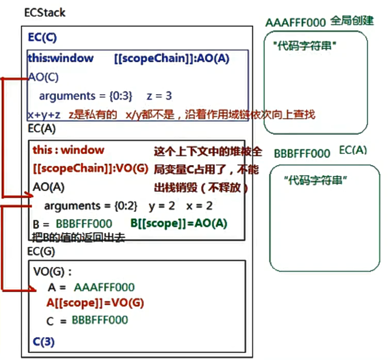

# JavaScript高级

### 一、数据类型

#### 基本数据类型

##### number

##### string

##### boolean

##### undefined

##### null

##### symbol

#### 引用数据类型

##### object

### 二、浏览器解析

#### 1、编译器

##### 1. 词法解析

##### 2. AST（抽象语法树）

##### 3. 编译和渲染

#### 2、引擎（V8）


### 三、堆栈内存

#### 1、ECStack（执行上下文环境）

#### 2、EC（执行上下文）

- 某个域下的代码都有自己的执行上下文
- 全局 EC(G)
  - GO全局对象：`global object` 在浏览器中，会把全局对象赋值给 `window = {...}`
  - 变量赋值（如：`a = 12`）
    - 创建变量（声明 declare）
    - 创建值：
      - 基本值直接在栈中创建和存储
      - 由于引用值是复杂的结构，所以特殊处理
        - 开辟一个存储对象中的键值对（存储函数中的代码）的内存空间（堆内存）
        - 所有的堆内存都有一个可被后续查找到的16进制子地址
        - 后续关联赋值的时候，是把对内存的地址给予变量操作
    - 让变量和值关联起来（赋值 定义 defined）
- 函数 EC(...)
- VO：Variable Object 变量对象
  - 作用：存储当前上下文中的变量
- AO：Activation Object 活动对象（函数的叫做AO，理解为VO的一个分支）
  - 非严格模式下，形参和实参会建立映射机制，严格模式下不会
  - ES6中的箭头函数中没有 `arguments` 实参集合
- Scope：作用域
- Scope Chain：作用域链
- 函数创建的时候
  - 创建了一个堆（存储代码字符串和对应的键值对）
  - 初始化了当前函数的作用域
    - [[scope]] = 所在上下文EC中的变量对象VO/AO
- 函数执行的时候
  - 创建一个新的执行上下文EC（压缩到ECStack里执行）
  - 初始化 this 指向
  - 初始化作用域链 [[scopeChain]] ：xxx
  - 创建AO变量对象用来存储变量
    - arguments
    - 形参
    - 代码执行
- 执行流程（文字）

```js
let x = 1;
function A(y){
    let x = 2;
    function B(z) {
        console.log(x + y + z);
    }
    return B;
}
let C = A(2);
C(3);

/* 第一步：创建全局执行上下文，并将其压入 ECStack 中 */
ECStack = [
    // -> 全局执行上下文
    EC(G) = {
        // -> 全局变量对象
        VO(G):
        	// -> 包含全局对象原有属性
        	x = 1;
        	A = function(y) {...}
            A[[scope]] = VO(G); // -> 创建函数的时候就确定了其作用域
    }
];
/* 第二步：执行函数A(2) */
ECStack = [
    // -> A的执行上下文
    EC(A) = {
        // -> 链表初始化为：AO(A) -> VO(G)
        [scope]: VO(G)
        scopeChain: <AO(A), A[[scope]]>
        // -> 创建函数A的活动对象
        AO(A): {
            arguments: [0: 2],
            y: 2,
            x: 2,
            B: function(z) {...},
            B[[scope]] = AO(A),
            this: window;
        }
    },
	// -> 全局执行上下文
	EC(G) = {
        // -> 全局变量对象
        VO(G): {
        	// -> 包含全局对象原有属性
        	x = 1;
        	A = function(y) {...};
            A[[scope]] = VO(G); // -> 创建函数的时候就确定了其作用域
    	}
    }
];

/* 第三步：执行 B/C 函数 C(3) */
ECStack = [
    // -> B的执行上下文
    EC(B) = {
        [scope]: AO(A)
        scopeChain: <AO(B), AO(A), B[[scope]]>
        // -> 创建函数B的活动对象
        AO(A): {
            arguments: [0: 3],
            z: 3,
            this: window;
        }
    },
    // -> A的执行上下文
    EC(A) = {
        // -> 链表初始化为：AO(A) -> VO(G)
        [scope]: VO(G)
        scopeChain: <AO(A), A[[scope]]>
        // -> 创建函数A的活动对象
        AO(A): {
            arguments: [0: 2],
            y: 2,
            x: 2,
            B: function(z) {...},
            B[[scope]] = AO(A),
            this: window;
        }
    },
	// -> 全局执行上下文
	EC(G) = {
        // -> 全局变量对象
        VO(G): {
        	// -> 包含全局对象原有属性
        	x = 1;
        	A = function(y) {...};
            A[[scope]] = VO(G); // -> 创建函数的时候就确定了其作用域
    	}
    }
];
```

- 执行流程（图）



#### 3、栈内存

- 执行代码
- 存储基本数据类型值

#### 4、堆内存

#### 5、垃圾回收机制

- 谷歌浏览器：浏览器会在空闲的时候，把所有不被占用的堆内存，进行释放和销毁。
- 低版本IE浏览器：当前堆被占用一次，计数字1，再被占用一次，数字累加，当取消占用，数字减去1，一直减到0则销毁。