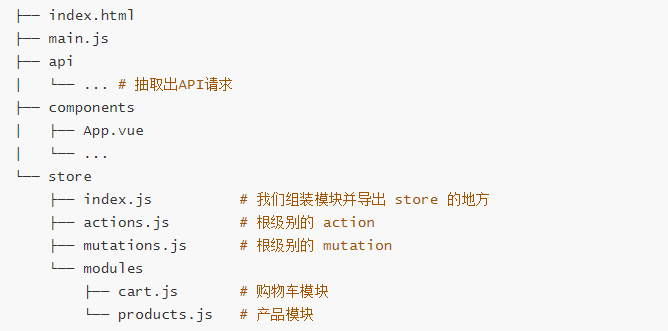

Vue.js 学习笔记

### 一、Vue实例

#### 1. 创建一个实例

```js
var vm = new Vue({
  // 选项
})
```

#### 2. 数据与方法

当一个 Vue 实例被创建时，它将 `data` 对象中的所有的 property 加入到 Vue 的**响应式系统**中。当这些 property 的值发生改变时，视图将会产生“响应”，即匹配更新为新的值。

**当这些数据改变时，视图会进行重渲染。**值得注意的是只有当实例被创建时就已经存在于 `data` 中的 property 才是**响应式**的。也就是说如果你添加一个新的 property，比如：

```js
vm.b = 'hi'
```

那么对 `b` 的改动将不会触发任何视图的更新。如果你知道你会在晚些时候需要一个 property，但是一开始它为空或不存在，那么你仅需要设置一些初始值。比如：

```js
data: {
  newTodoText: '',
  visitCount: 0,
  hideCompletedTodos: false,
  todos: [],
  error: null
}
```

这里唯一的例外是使用 `Object.freeze()`，这会阻止修改现有的 property，也意味着响应系统无法再*追踪*变化。

**`Object.freeze()`** 方法可以**冻结**一个对象。一个被冻结的对象再也不能被修改；冻结了一个对象则不能向这个对象添加新的属性，不能删除已有属性，不能修改该对象已有属性的可枚举性、可配置性、可写性，以及不能修改已有属性的值。此外，冻结一个对象后该对象的原型也不能被修改。`freeze()` 返回和传入的参数相同的对象。

```js
var obj = {
  foo: 'bar'
}

Object.freeze(obj)

new Vue({
  el: '#app',
  data: obj
})
<div id="app">
  <p>{{ foo }}</p>
  <!-- 这里的 `foo` 不会更新！ -->
  <button v-on:click="foo = 'baz'">Change it</button>
</div>
```

除了数据 property，Vue 实例还暴露了一些有用的实例 property 与方法。它们都有前缀 `$`，以便与用户定义的 property 区分开来。例如：

```js
var data = { a: 1 }
var vm = new Vue({
  el: '#example',
  data: data
})

vm.$data === data // => true
vm.$el === document.getElementById('example') // => true

// $watch 是一个实例方法
vm.$watch('a', function (newValue, oldValue) {
  // 这个回调将在 `vm.a` 改变后调用
})
```

以后你可以在 [API 参考](https://cn.vuejs.org/v2/api/#实例-property)中查阅到完整的实例 property 和方法的列表。

#### 3. 实例生命周期钩子

每个 Vue 实例在被创建时都要经过一系列的初始化过程——例如，需要设置数据监听、编译模板、将实例挂载到 DOM 并在数据变化时更新 DOM 等。同时在这个过程中也会运行一些叫做**生命周期钩子**的函数，这给了用户在不同阶段添加自己的代码的机会。

比如 [`created`](https://cn.vuejs.org/v2/api/#created) 钩子可以用来在一个实例被创建之后执行代码：

```js
new Vue({
  data: {
    a: 1
  },
  created: function () {
    // `this` 指向 vm 实例
    console.log('a is: ' + this.a)
  }
})
// => "a is: 1"
```

也有一些其它的钩子，在实例生命周期的不同阶段被调用，如 [`mounted`](https://cn.vuejs.org/v2/api/#mounted)、[`updated`](https://cn.vuejs.org/v2/api/#updated) 和 [`destroyed`](https://cn.vuejs.org/v2/api/#destroyed)。生命周期钩子的 `this` 上下文指向调用它的 Vue 实例。

**注意点：**

不要在选项 property 或回调上使用**[箭头函数](https://developer.mozilla.org/zh-CN/docs/Web/JavaScript/Reference/Functions/Arrow_functions)**，比如 `created: () => console.log(this.a)` 或 `vm.$watch('a', newValue => this.myMethod())`。因为箭头函数并没有 `this`，`this` 会作为变量一直向上级词法作用域查找，直至找到为止，经常导致 `Uncaught TypeError: Cannot read property of undefined` 或 `Uncaught TypeError: this.myMethod is not a function` 之类的错误。

#### 4. 渐进式框架

- 渐进式意味着可以将 `Vue` 作为你应用的一部分嵌入其中，带来更加丰富的交互体验
- 或者如果你希望将更多的业务逻辑使用 `Vue` 实现，那么 `Vue` 的核心库以及其生态系统
- 比如 `Core +  Vue-router + Vuex`，也可以满足你各种各样的需求。

#### 5. 高级功能

- 解耦视图和数据
- 可复用组件
- 前端路由技术
- 状态管理
- 虚拟 DOM

### 二、模板语法

##### 修饰符

Vue提供了一些修饰符，这些修饰符在使用起来非常方便，比如阻止默认事件、冒泡等。

###### .lazy：

v-modeil不用多说，输入框改变，这个数据就会改变，lazy这个修饰符会在光标离开input框才会更新数据：

```bash
<input type="text" v-model.lazy="value">
```

###### .trim：

输入框过滤首尾的空格：

```bash
<input type="text" v-model.trim="value">
```

###### .number：

先输入数字就会限制输入只能是数字，先字符串就相当于没有加number，注意，不是输入框不能输入字符串，是这个数据是数字：

```bash
<input type="text" v-model.number="value">
```

###### .stop：

阻止事件冒泡，相当于调用了event.stopPropagation()方法。这个应该不需要解释：

```css
<button @click.stop="test">test</button>
```

###### .prevent：

阻止默认行为，相当于调用了event.preventDefault()方法，比如表单的提交、a标签的跳转就是默认事件：

```css
<a @click.prevent="test">test</a>
```

###### .self：

只有元素本身触发时才触发方法，就是只有点击元素本身才会触发。比如一个div里面有个按钮，div和按钮都有事件，我们点击按钮，div绑定的方法也会触发，如果div的click加上self，只有点击到div的时候才会触发，变相的算是阻止冒泡：

```css
<div @click.self="test"></div>
```

###### .once：

只能用一次，无论点击几次，执行一次之后都不会再执行：

```css
<div @click.once="test"></div>
```

###### .capture：

事件的完整机制是捕获-目标-冒泡，事件触发是目标往外冒泡，比如：

```xml
<div @click="test(1)">  <button @click="test(2)">test</button></div>

顺序是2 1，capture的作用就是让这个顺序相反：

<div @click.capture="test(1)">  <button @click="test(2)">test</button></div>
```

先1 后2。

###### .passive：

其实我不怎么理解，官网解释说可以提升移动端的性能，查了查，大概解释就是每次滚动都会有一个默认事件触发，加了这个就是告诉浏览器，不需要查询，不需要触发这个默认事件preventDefault：

```xml
<!-- 滚动事件的默认行为 (即滚动行为) 将会立即触发 --> 

<!-- 而不会等待 `onScroll` 完成 -->

 <!-- 这其中包含 `event.preventDefault()` 的情况 -->

<div v-on:scroll.passive="onScroll">...</div>
```

###### .native：

组件绑定当前组件的事件是不会触发的，需要用native才能触发：

```css
<My-component @click="shout(3)"></My-component>
```

鼠标.left、.reight、.middle：

就是鼠标点击的时候就触发：

```css
<button @click.right="test">test</button>
```

###### .keyCode：

监听按键的指令，具体可以查看vue的键码对应表：

```xml
<input type="text" @keyup.enter="test(1)">

<button @click.enter="test(1)">test</button>
```

注意，只有你点击过一次或者聚焦到这个输入框才能使用键盘触发。

###### .exact：

系统修饰键，只有按着这个键然后用鼠标点击才会触发，官网解释：

```xml
<!-- 即使 Alt 或 Shift 被一同按下时也会触发 -->

 <button @click.ctrl="onClick">A</button>

<!-- 有且只有 Ctrl 被按下的时候才触发 -->

<button @click.ctrl.exact="onCtrlClick">A</button>

<!-- 没有任何系统修饰符被按下的时候才触发 -->
<button @click.exact="onClick">A</button>
```

但是我试了一下没有用。

###### .sync

对prop进行双向绑定，个人暂时用不习惯：

```php
//父组件

<fa-comp :fatest.sync="test"></fa-comp>

//子组件

this.$emit('update:fatest,sontest);
```

### 三、计算属性和侦听器

#### 1. 基础例子

```js
<div id="example">
    <p>Original message: "{{ message }}"</p>
    <p>Computed reversed message: "{{ reversedMessage }}"</p>
    <p>Computed reversed message2: "{{ reversedMessage2() }}"</p>
</div>
<script src="../插件/vue.js"></script>
<script>
    var vm = new Vue({
        el: "#example",
        data: {
            message: "Hello",
        },
        computed: {
            reversedMessage: function () {
                return this.message.split('').reverse().join('');
            }
        },
        methods: {
            reversedMessage2: function () {
                return this.message.split('').reverse().join('');
            }
        }
    });
</script>
```

我们可以将同一函数定义为一个方法而不是一个计算属性。两种方式的最终结果确实是完全相同的。然而，不同的是**计算属性是基于它们的响应式依赖进行缓存的**。只在相关响应式依赖发生改变时它们才会重新求值。这就意味着只要 `message` 还没有发生改变，多次访问 `reversedMessage` 计算属性会立即返回之前的计算结果，而不必再次执行函数。

#### 2. 侦听属性

Vue 提供了一种更通用的方式来观察和响应 Vue 实例上的数据变动：**侦听属性**。当你有一些数据需要随着其它数据变动而变动时，你很容易滥用 `watch`——特别是如果你之前使用过 AngularJS。然而，通常更好的做法是使用计算属性而不是命令式的 `watch` 回调。细想一下这个例子：

```js
<div id="demo">{{ fullName }}</div>
var vm = new Vue({
  el: '#demo',
  data: {
    firstName: 'Foo',
    lastName: 'Bar',
    fullName: 'Foo Bar'
  },
  watch: {
    firstName: function (val) {
      this.fullName = val + ' ' + this.lastName
    },
    lastName: function (val) {
      this.fullName = this.firstName + ' ' + val
    }
  }
})
```

上面代码是命令式且重复的。将它与计算属性的版本进行比较：

```js
var vm = new Vue({
  el: '#demo',
  data: {
    firstName: 'Foo',
    lastName: 'Bar'
  },
  computed: {
    fullName: function () {
      return this.firstName + ' ' + this.lastName
    }
  }
})
```

- watch主要用于监控vue实例的变化，它监控的变量当然必须在data里面声明才可以，它可以监控一个变量，也可以是一个对象，但是我们不能类似这样监控，比如：

```js
watch:{
	goodsList.price(newVal,oldVal){
    //监控商品列表中是商品价格
	}
}
```

这样会报错。只能监控整个对象或单个变量，如下所示：

```js
data(){
     return {
         example0:"",
         example1:"",
         example2:{
             inner0:1, 　　　　　　　　　
             innner1:2 　　　　　　　　　
         }
     }
 },
watch:{
　example0(newVal,oldVal){//监控单个变量
           ……
   }，example2(newVal,oldVal){//监控对象
           ……
   }，
}
```

- watch一般用于监控路由、input输入框的值特殊处理等等，它比较适合的场景是一个数据影响多个数据

#### 3. 计算属性的 `getter` 和 `setter`

计算属性 `computed` 里面还有两个方法，一个 `get`，一个 `set` 。

计算属性的默认是用 `get` ，就是把值返回出去，比如基础例子。也可以写成如下：

```js
reversedMessage: function () {
    // 控制台输入 vm.reversedMessage = 'xxx'
    // Computed property "reversedMessage" was assigned to but it has no setter.
    return this.message.split('').reverse().join('');
}
reversedMessage: {
    get: function () {
        // 控制台输入 vm.reversedMessage = 'xxx'
        // Computed property "reversedMessage" was assigned to but it has no setter.
        return this.message.split('').reverse().join('');
    }
}
```

`set` 方法有一个参数 `value` ，现在再运行 `vm.fullName = 'John Doe'` 时，setter 会被调用，`vm.firstName` 和 `vm.lastName` 也会相应地被更新。

```js
var vm2 = new Vue({
    el: '#demo',
    data: {
        firstName: 'Foo',
        lastName: 'Bar'
    },
    computed: {
        fullName: {
            // getter
            get: function () {
                console.log("调用getter");
                return this.firstName + ' ' + this.lastName
            },
            // setter
            set: function (newValue) {
                console.log("调用setter");
                var names = newValue.split(' ')
                this.firstName = names[0]
                this.lastName = names[names.length - 1]
            }
        }
    }
})
```

**注：计算属性一般是没有set方法的**

#### 4. 计算属性和 `methods` 的对比

计算属性的性能比 `methods` 要高

因为计算属性有一个缓存的作用，当遇到反复调用一个东西时它进行检查是否发生改变，若没有发生改变，将不会反复的循环调用，而是直接引用上一次的结果。

#### 5. 侦听器

虽然计算属性在大多数情况下更合适，但有时也需要一个自定义的侦听器。这就是为什么 Vue 通过 `watch` 选项提供了一个更通用的方法，来响应数据的变化。当需要在数据变化时执行异步或开销较大的操作时，这个方式是最有用的。

```js
<div id="watch-example">
    <p>
        Ask a yes/no question:
        <input v-model="question">
    </p>
    <p>{{ answer }}</p>
</div>
<script src="../插件/vue.js"></script>
<script src="https://cdn.jsdelivr.net/npm/axios@0.12.0/dist/axios.min.js"></script>
<script src="https://cdn.jsdelivr.net/npm/lodash@4.13.1/lodash.min.js"></script>
<script>
    var watchExampleVM = new Vue({
        el: '#watch-example',
        data: {
            question: '',
            answer: 'I cannot give you an answer until you ask a question!'
        },
        watch: {
            // 如果 `question` 发生改变，这个函数就会运行
            question: function (newQuestion, oldQuestion) {
                this.answer = 'Waiting for you to stop typing...'
                this.debouncedGetAnswer()
            }
        },
        created: function () {
            // `_.debounce` 是一个通过 Lodash 限制操作频率的函数。
            // 在这个例子中，我们希望限制访问 yesno.wtf/api 的频率
            // AJAX 请求直到用户输入完毕才会发出。想要了解更多关于
            // `_.debounce` 函数 (及其近亲 `_.throttle`) 的知识，
            // 请参考：https://lodash.com/docs#debounce
            this.debouncedGetAnswer = _.debounce(this.getAnswer, 500)
        },
        methods: {
            getAnswer: function () {
                if (this.question.indexOf('?') === -1) {
                    this.answer = 'Questions usually contain a question mark. ;-)'
                    return
                }
                this.answer = 'Thinking...'
                var vm = this
                axios.get('https://yesno.wtf/api')
                    .then(function (response) {
                        vm.answer = _.capitalize(response.data.answer)
                    })
                    .catch(function (error) {
                        vm.answer = 'Error! Could not reach the API. ' + error
                    })
            }
        }
    })
</script>
```

在这个示例中，使用 `watch` 选项允许我们执行异步操作 (访问一个 API)，限制我们执行该操作的频率，并在我们得到最终结果前，设置中间状态。这些都是计算属性无法做到的。

### 四、class 和 style 绑定

#### 绑定 HTML Class

```js
<div id="app">
    <div v-bind:class="{ active: isActive }"></div>
    <div class="one" v-bind:class="{ active: isActive, 'text-danger': hasError }"></div>
    <div v-bind:class="classObject"></div>
    <div v-bind:class="classObjectComputed"></div>
    <!-- 数组语法 -->
    <p v-bind:class="[activeClass, errorClass]"></p>
    <div v-bind:class="[isActive ? activeClass : '', errorClass]"></div>
    <div v-bind:class="[{ active: isActive }, errorClass]"></div>
</div>
<script src="../插件/vue.js"></script>
<script>
    var vm = new Vue({
        el: "#app",
        data: {
            isActive: true,
            hasError: true,
            error: null,
            classObject: {
                active: true,
                'text-danger': true,
            },
            activeClass: 'active',
            errorClass: 'text-danger',
        },
        computed: {
            classObjectComputed: function () {
                return {
                    active: this.isActive && !this.error,
                    'text-danger': this.error && this.error.type === 'fatal'
                }
            }
        }
    })
</script>
```

当在一个自定义组件上使用 `class` property 时，这些 class 将被添加到该组件的根元素上面。这个元素上已经存在的 class 不会被覆盖。

例如，如果你声明了这个组件：

```js
Vue.component('my-component', {
  template: '<p class="foo bar">Hi</p>'
})
```

然后在使用它的时候添加一些 class：

```js
<my-component class="baz boo"></my-component>
```

HTML 将被渲染为：

```js
<p class="foo bar baz boo">Hi</p>
```

对于带数据绑定 class 也同样适用：

```js
<my-component v-bind:class="{ active: isActive }"></my-component>
```

当 `isActive` 为 truthy[[1\]](https://cn.vuejs.org/v2/guide/class-and-style.html#footnote-1) 时，HTML 将被渲染成为：

```js
<p class="foo bar active">Hi</p>
```

### 五、列表渲染

#### 1. `v-for` 的使用

**当 `v-if` 与 `v-for` 一起使用时，`v-for` 具有比 `v-if` 更高的优先级。**

在 `v-for` 块中，我们可以访问所有父作用域的 property。`v-for` 还支持一个可选的第二个参数，即当前项的索引。

```js
<ul id="example-2">
    <li v-for="(item, index) in items">
        {{ parentMessage}} - {{index}} - {{ item.message }}
    </li>
</ul>
<script>
        var example2 = new Vue({
            el: "#example-2",
            data: {
                parentMessage: "Parent",
                items: [{
                    message: "Foo",
                }, {
                    message: "Bar",
                }],
            }
        });
</script>
// Parent - 0 - Foo
// Parent - 1 - Bar
```

也可以用 `of` 替代 `in` 作为分隔符，因为它更接近 JavaScript 迭代器的语法

在 `v-for` 里面使用对象，第一个参数是值，第二个参数是键值，第三个参数是索引

```js
<li v-for="(value, keyName, index) in object"></li>
```

在遍历对象时，会按 `Object.keys()` 的结果遍历，但是**不能**保证它的结果在不同的 JavaScript 引擎下都一致。

#### 2. 维护状态

建议尽可能在使用 `v-for` 时提供 `key` attribute，除非遍历输出的 DOM 内容非常简单，或者是刻意依赖默认行为以获取性能上的提升。因为它是 Vue 识别节点的一个通用机制，`key` 并不仅与 `v-for` 特别关联。后面我们将在指南中看到，它还具有其它用途。

不要使用对象或数组之类的非基本类型值作为 `v-for` 的 `key`。请用字符串或数值类型的值。

#### 3. 数组更新检测

##### 3.1 变更方法

Vue 将被侦听的数组的变更方法进行了包裹，所以它们也将会触发视图更新。这些被包裹过的方法包括：

- 在 Vue 中，直接修改对象属性的值无法触发响应式。当你直接修改了对象属性的值，你会发现，只有数据改了，但是页面内容并没有改变
- 变异数组方法即保持数组方法原有功能不变的前提下对其进行功能拓展

| `push()`    | 往数组最后面添加一个元素，成功返回当前数组的长度             |
| ----------- | ------------------------------------------------------------ |
| `pop()`     | 删除数组的最后一个元素，成功返回删除元素的值                 |
| `shift()`   | 删除数组的第一个元素，成功返回删除元素的值                   |
| `unshift()` | 往数组最前面添加一个元素，成功返回当前数组的长度             |
| `splice()`  | 有三个参数，第一个是想要删除的元素的下标（必选），第二个是想要删除的个数（必选），第三个是删除 后想要在原位置替换的值 |
| `sort()`    | sort()  使数组按照字符编码默认从小到大排序,成功返回排序后的数组 |
| `reverse()` | reverse()  将数组倒序，成功返回倒序后的数组                  |

你可以打开控制台，然后对前面例子的 `items` 数组尝试调用变更方法。比如 `example1.items.push({ message: 'Baz' })`。

##### 3.2 替换数组

变更方法，顾名思义，会变更调用了这些方法的原始数组。相比之下，也有非变更方法，例如 `filter()`、`concat()` 和 `slice()`。它们不会变更原始数组，而**总是返回一个新数组**。当使用非变更方法时，可以用新数组替换旧数组：

```js
example1.items = example1.items.filter(function (item) {
  return item.message.match(/Foo/)
})
```

你可能认为这将导致 Vue 丢弃现有 DOM 并重新渲染整个列表。幸运的是，事实并非如此。Vue 为了使得 DOM 元素得到最大范围的重用而实现了一些智能的启发式方法，所以用一个含有相同元素的数组去替换原来的数组是非常高效的操作。

- **不会改变原始数组，但总是返回一个新数组**

| filter | filter() 方法创建一个新的数组，新数组中的元素是通过检查指定数组中符合条件的所有元素。 |
| ------ | ------------------------------------------------------------ |
| concat | concat() 方法用于连接两个或多个数组。该方法不会改变现有的数组 |
| slice  | slice() 方法可从已有的数组中返回选定的元素。该方法并不会修改数组，而是返回一个子数组 |

##### 3.3 注意事项

由于 JavaScript 的限制，Vue **不能检测**数组和对象的变化。[深入响应式原理](https://cn.vuejs.org/v2/guide/reactivity.html#检测变化的注意事项)中有相关的讨论。

#### 4. 在 `<template>` 上使用 `v-for`

类似于 `v-if`，你也可以利用带有 `v-for` 的 `<template>` 来循环渲染一段包含多个元素的内容。比如：

```js
<ul>
  <template v-for="item in items">
    <li>{{ item.msg }}</li>
    <li class="divider" role="presentation"></li>
  </template>
</ul>
```

####  5. `v-for` 与 `v-if` 一起使用

注意我们**不**推荐在同一元素上使用 `v-if` 和 `v-for`。

当它们处于同一节点，`v-for` 的优先级比 `v-if` 更高，这意味着 `v-if` 将分别重复运行于每个 `v-for` 循环中。当你只想为**部分**项渲染节点时，这种优先级的机制会十分有用

而如果你的目的是有条件地跳过循环的执行，那么可以将 `v-if` 置于外层元素 (或 `<template>`) 上。

#### 6. 在组件上使用 `v-for`

在自定义组件上，你可以像在任何普通元素上一样使用 `v-for`。

```js
<my-component v-for="item in items" :key="item.id"></my-component>
```

> 2.2.0+ 的版本里，当在组件上使用 `v-for` 时，`key` 现在是必须的。

然而，任何数据都不会被自动传递到组件里，因为组件有自己独立的作用域。为了把迭代数据传递到组件里，我们要使用 prop：

```js
<my-component
  v-for="(item, index) in items"
  v-bind:item="item"
  v-bind:index="index"
  v-bind:key="item.id"
></my-component>
```

不自动将 `item` 注入到组件里的原因是，这会使得组件与 `v-for` 的运作紧密耦合。明确组件数据的来源能够使组件在其他场合重复使用。

实例：

```js
<div id="todo-list-example">
    <form v-on:submit.prevent="addNewTodo">
        <label for="new-todo">Add a todo</label>
        <input v-model="newTodoText" id="new-todo" placeholder="E.g. Feed the cat">
        <button>Add</button>
    </form>
    <ul>
        <!-- 注意这里的 is="todo-item" attribute。这种做法在使用 DOM 模板时是十分必要的，因为在 <ul> 元素内只有 <li> 元素会被看作有效内容。这样做实现的效果与 <todo-item> 相同，但是可以避开一些潜在的浏览器解析错误。 -->
        <li is="todo-item" v-for="(todo, index) in todos" v-bind:key="todo.id" v-bind:title="todo.title"
            v-on:remove="todos.splice(index, 1)"></li>
    </ul>
</div>
<script src="../插件/vue.js"></script>
<script>
    Vue.component('todo-item', {
        template: '\
    <li>\
        {{ title }}\
        <button v-on:click="$emit(\'remove\')">Remove</button>\
    </li>\
    ',
        props: ['title']
    })

    var todo = new Vue({
        el: '#todo-list-example',
        data: {
            newTodoText: '',
            todos: [{
                    id: 1,
                    title: 'Do the dishes',
                },
                {
                    id: 2,
                    title: 'Take out the trash',
                },
                {
                    id: 3,
                    title: 'Mow the lawn'
                }
            ],
            nextTodoId: 4
        },
        methods: {
            addNewTodo: function () {
                this.todos.push({
                    id: this.nextTodoId++,
                    title: this.newTodoText
                })
                this.newTodoText = ''
            }
        }
    })
</script>
```

### 六、事件处理

#### 1. 事件修饰符

在事件处理程序中调用 `event.preventDefault()` 或 `event.stopPropagation()` 是非常常见的需求。尽管我们可以在方法中轻松实现这点，但更好的方式是：方法只有纯粹的数据逻辑，而不是去处理 DOM 事件细节。

为了解决这个问题，Vue.js 为 `v-on` 提供了**事件修饰符**。之前提过，修饰符是由点开头的指令后缀来表示的。

- `.stop`：阻止单击事件继续传播（阻止事件冒泡）
- `.prevent`：提交事件不再重载页面
- `.capture`：添加事件监听器时使用事件捕获模式
- `.self`：只当在 `event.target` 是当前元素自身时触发处理函数
- `.once`：点击事件将只会触发一次
- `.passive`

```html
<!-- 阻止单击事件继续传播 -->
<a v-on:click.stop="doThis"></a>

<!-- 提交事件不再重载页面 -->
<form v-on:submit.prevent="onSubmit"></form>

<!-- 修饰符可以串联 -->
<a v-on:click.stop.prevent="doThat"></a>

<!-- 只有修饰符 -->
<form v-on:submit.prevent></form>

<!-- 添加事件监听器时使用事件捕获模式 -->
<!-- 即内部元素触发的事件先在此处理，然后才交由内部元素进行处理 -->
<div v-on:click.capture="doThis">...</div>

<!-- 只当在 event.target 是当前元素自身时触发处理函数 -->
<!-- 即事件不是从内部元素触发的 -->
<div v-on:click.self="doThat">...</div>

<!-- 点击事件将只会触发一次 -->
<a v-on:click.once="doThis"></a>
<!-- 不像其它只能对原生的 DOM 事件起作用的修饰符，.once 修饰符还能被用到自定义的组件事件上。 -->

<!-- Vue 还对应 addEventListener 中的 passive 选项提供了 .passive 修饰符。 -->
<!-- 滚动事件的默认行为 (即滚动行为) 将会立即触发 -->
<!-- 而不会等待 `onScroll` 完成  -->
<!-- 这其中包含 `event.preventDefault()` 的情况 -->
<div v-on:scroll.passive="onScroll">...</div>
<!-- 不要把 .passive 和 .prevent 一起使用，因为 .prevent 将会被忽略，同时浏览器可能会向你展示一个警告。请记住，.passive 会告诉浏览器你不想阻止事件的默认行为。 -->
```

> 使用修饰符时，顺序很重要；相应的代码会以同样的顺序产生。因此，用 `v-on:click.prevent.self` 会阻止**所有的点击**，而 `v-on:click.self.prevent` 只会阻止对元素自身的点击。

#### 2. 按键修饰符

在监听键盘事件时，我们经常需要检查详细的按键。Vue 允许为 `v-on` 在监听键盘事件时添加按键修饰符：

```html
<!-- 只有在 `key` 是 `Enter` 时调用 `vm.submit()` -->
<input v-on:keyup.enter="submit">
```

你可以直接将 [`KeyboardEvent.key`](https://developer.mozilla.org/en-US/docs/Web/API/KeyboardEvent/key/Key_Values) 暴露的任意有效按键名转换为 kebab-case 来作为修饰符。

```html
<input v-on:keyup.page-down="onPageDown">
```

在上述示例中，处理函数只会在 `$event.key` 等于 `PageDown` 时被调用。

##### 2.1 按键码

`keyCode` 的事件用法[已经被废弃了](https://developer.mozilla.org/en-US/docs/Web/API/KeyboardEvent/keyCode)并可能不会被最新的浏览器支持。

使用 `keyCode` attribute 也是允许的：

```html
<input v-on:keyup.13="submit">
```

为了在必要的情况下支持旧浏览器，Vue 提供了绝大多数常用的按键码的别名：

- `.enter`
- `.tab`
- `.delete` (捕获“删除”和“退格”键)
- `.esc`
- `.space`
- `.up`
- `.down`
- `.left`
- `.right`

有一些按键 (`.esc` 以及所有的方向键) 在 IE9 中有不同的 `key` 值, 如果你想支持 IE9，这些内置的别名应该是首选。

你还可以通过全局 `config.keyCodes` 对象[自定义按键修饰符别名](https://cn.vuejs.org/v2/api/#keyCodes)：

```js
// 可以使用 `v-on:keyup.f1`
Vue.config.keyCodes.f1 = 112
```

#### 3. 为什么在 HTML 中监听事件

这种事件监听的方式违背了关注点分离 (separation of concern) 这个长期以来的优良传统。但不必担心，因为所有的 Vue.js 事件处理方法和表达式都严格绑定在当前视图的 ViewModel 上，它不会导致任何维护上的困难。实际上，使用 `v-on` 有几个好处：

1. 扫一眼 HTML 模板便能轻松定位在 JavaScript 代码里对应的方法。
2. 因为你无须在 JavaScript 里手动绑定事件，你的 ViewModel 代码可以是非常纯粹的逻辑，和 DOM 完全解耦，更易于测试。
3. 当一个 ViewModel 被销毁时，所有的事件处理器都会自动被删除。你无须担心如何清理它们。

#### 4. 调用 `event` 对象

**注意：**

1. 在事件定义时，写方法时省略了小括号，但是方法本身是需要一个参数的，这个时候 `Vue` 会默认将浏览器产生的 `event` 事件对象作为参数传入到方法。
2. 方法定义时，如果我们既需要 `event` 对象，又需要其他的参数对象，在调用方法时，通过 `$event` 获取浏览器的参数对象 `event`。

### 七、表单输入绑定

#### 基础用法

你可以用 `v-model` 指令在表单 `<input>`、`<textarea>` 及 `<select>` 元素上创建双向数据绑定。它会根据控件类型自动选取正确的方法来更新元素。尽管有些神奇，但 `v-model` 本质上不过是语法糖。它负责监听用户的输入事件以更新数据，并对一些极端场景进行一些特殊处理。

> `v-model` 会忽略所有表单元素的 `value`、`checked`、`selected` attribute 的初始值而总是将 Vue 实例的数据作为数据来源。你应该通过 JavaScript 在组件的 `data` 选项中声明初始值。

`v-model` 在内部为不同的输入元素使用不同的 property 并抛出不同的事件：

- text 和 textarea 元素使用 `value` property 和 `input` 事件；
- checkbox 和 radio 使用 `checked` property 和 `change` 事件；
- select 字段将 `value` 作为 prop 并将 `change` 作为事件。

> 对于需要使用[输入法](https://zh.wikipedia.org/wiki/输入法) (如中文、日文、韩文等) 的语言，你会发现 `v-model` 不会在输入法组合文字过程中得到更新。如果你也想处理这个过程，请使用 `input` 事件。

> 在文本区域插值 (`<textarea>{{text}}</textarea>`) 并不会生效，应用 `v-model` 来代替。

#### 复选框问题解释

1. checkbox和普通input一样，点击勾选其实就是输入value，而输入value会改变checked属性，所以会选中，当v-model对应“字符串”时会解析“字符串”为布尔值，v-model对应有值或是true，checkbox都会选中。（经测试，若 v-model 里的属性值为**truthy**（真值）时checkbox就会选中）

2. 当v-model对应“数组”时有勾表示已选中，相当于赋值给，相当于有value，v-model对应value, 

   没有value属性时，点勾相当于将('null')赋值给value——>v-model('null'为字符串),

   有value属性时，点勾相当于将(value)赋值给value——>v-model，

   注意数据是双向绑定的，所以数组里的值对应着checkbox的value——>v-model。

3. 处理表单，v-model一般都是对应字符串，所以处理checkbox的v-model，善用对应布尔值控制勾选。

```html
<input
  type="checkbox"
  v-model="toggle"
  true-value="yes"
  false-value="no"
>
```

```js
// 当选中时
vm.toggle === 'yes'
// 当没有选中时
vm.toggle === 'no'
```

> 这里的 `true-value` 和 `false-value` attribute 并不会影响输入控件的 `value` attribute，因为浏览器在提交表单时并不会包含未被选中的复选框。如果要确保表单中这两个值中的一个能够被提交，(即“yes”或“no”)，请换用单选按钮。

#### 选择框

```html
<select v-model="selected">
    <option disabled value="">请选择</option>
    <option>A</option>
    <option>B</option>
    <!-- 如果 value 值不为空，那么 selected 所取得的值为 value 否则为option的内容 -->
    <option value="D">C</option>
</select>
<span>Selected: {{ selected }}</span>
```

```js
new Vue({
  el: '...',
  data: {
    selected: ''
  }
})
```

> 如果 `v-model` 表达式的初始值未能匹配任何选项，`<select>` 元素将被渲染为“未选中”状态。在 iOS 中，这会使用户无法选择第一个选项。因为这样的情况下，iOS 不会触发 change 事件。因此，更推荐像上面这样提供一个值为空的禁用选项。

#### 值绑定

对于单选按钮，复选框及选择框的选项，`v-model` 绑定的值通常是静态字符串 (对于复选框也可以是布尔值)：

```html
<!-- 当选中时，`picked` 为字符串 "a" -->
<input type="radio" v-model="picked" value="a">

<!-- `toggle` 为 true 或 false -->
<input type="checkbox" v-model="toggle">html

<!-- 当选中第一个选项时，`selected` 为字符串 "abc" -->
<select v-model="selected">
  <option value="abc">ABC</option>
</select>
```

但是有时我们可能想把值绑定到 Vue 实例的一个动态 property 上，这时可以用 `v-bind` 实现，并且这个 property 的值可以不是字符串。

#### 修饰符

**.lazy**

在默认情况下，`v-model` 在每次 `input` 事件触发后将输入框的值与数据进行同步 (除了[上述](https://cn.vuejs.org/v2/guide/forms.html#vmodel-ime-tip)输入法组合文字时)。你可以添加 `lazy` 修饰符，从而转为在 `change` 事件_之后_进行同步：

```
<!-- 在“change”时而非“input”时更新 -->
<input v-model.lazy="msg">
```

**.number**

如果想自动将用户的输入值转为数值类型，可以给 `v-model` 添加 `number` 修饰符：

```
<input v-model.number="age" type="number">
```

这通常很有用，因为即使在 `type="number"` 时，HTML 输入元素的值也总会返回字符串。如果这个值无法被 `parseFloat()` 解析，则会返回原始的值。

**.trim**

如果要自动过滤用户输入的首尾空白字符，可以给 `v-model` 添加 `trim` 修饰符：

```
<input v-model.trim="msg">
```

### 八、组件基础

#### 一、基本示例

组件是可复用的 Vue 实例，且带有一个名字：在这个例子中是 `<button-counter>`。我们可以在一个通过 `new Vue` 创建的 Vue 根实例中，把这个组件作为自定义元素来使用：

```js
<div id="components-demo">
    <button-counter></button-counter>
</div>
<script src="../插件/vue.js"></script>
<script>
    Vue.component('button-counter', {
        data: function () {
            return {
                count: 0
            }
        },
        template: '<button v-on:click="count++">You clicked me {{ count }} times.</button>'
    });
    new Vue({
        el: '#components-demo'
    });
</script>
```

因为组件是可复用的 Vue 实例，所以它们与 `new Vue` 接收相同的选项，例如 `data`、`computed`、`watch`、`methods` 以及生命周期钩子等。仅有的例外是像 `el` 这样根实例特有的选项。

你可以将组件进行任意次数的复用：

```html
<div id="components-demo">
  <button-counter></button-counter>
  <button-counter></button-counter>
  <button-counter></button-counter>
</div>
```

注意当点击按钮时，每个组件都会各自独立维护它的 `count`。因为你每用一次组件，就会有一个它的新 **实例** 被创建。

##### `data` 必须是一个函数

当我们定义这个 `<button-counter>` 组件时，你可能会发现它的 `data` 并不是像这样直接提供一个对象：

```js
data: {
  count: 0
}
```

取而代之的是，**一个组件的 `data` 选项必须是一个函数**，因此每个实例可以维护一份被返回对象的独立的拷贝：

```js
data: function () {
  return {
    count: 0
  }
}
```

如果 Vue 没有这条规则，点击一个按钮就可能会影响到**其它所有实例**

##### 注意事项

1. 组件参数的data值必须是函数，同时这个函数要求返回一个对象
2. 组件模板必须是单个根元素
3. 组件模板的内容可以是模板字符串
4. 组件可以重复使用多次，因为data中返回的是一个对象所以每个组件中的数据是私有的，即每个实例可以维护一份被返回对象的独立的拷贝
5. 如果使用驼峰式命名组件，那么在使用组件的时候，**只能在字符串模板中用驼峰的方式使用组件**，但是**在普通的标签模板中，必须使用短横线的方式使用组件**

##### 局部注册

```js
<div id="app">
	<my-component></my-component>
</div>
<script>
    // 定义组件的模板
	var Child = {
		template: '<div>A custom component!</div>'
	}
	new Vue({
	//局部注册组件  
	components: {
	// <my-component> 将只在父模板可用，一定要在实例上注册了才能在html文件中使用
		'my-component': Child
	}
})
</script>
```


#### 二、组件的组织

通常一个应用会以一棵嵌套的组件树的形式来组织：


例如，你可能会有页头、侧边栏、内容区等组件，每个组件又包含了其它的像导航链接、博文之类的组件。

为了能在模板中使用，这些组件必须先注册以便 Vue 能够识别。这里有两种组件的注册类型：**全局注册**和**局部注册**。至此，我们的组件都只是通过 `Vue.component` **全局注册**的：

```js
Vue.component('my-component-name', {
  // ... options ...
})
```

全局注册的组件可以用在其被注册之后的任何 (通过 `new Vue`) 新创建的 Vue 根实例，也包括其组件树中的所有子组件的模板中。

到目前为止，关于组件注册你需要了解的就这些了，如果你阅读完本页内容并掌握了它的内容，我们会推荐你再回来把[组件注册](https://cn.vuejs.org/v2/guide/components-registration.html)读完。

#### 三、通过 Prop 向子组件传递数据（单向数据流）

早些时候，我们提到了创建一个博文组件的事情。问题是如果你不能向这个组件传递某一篇博文的标题或内容之类的我们想展示的数据的话，它是没有办法使用的。这也正是 prop 的由来。

Prop 是你可以在组件上注册的一些自定义 attribute。当一个值传递给一个 prop attribute 的时候，它就变成了那个组件实例的一个 property。为了给博文组件传递一个标题，我们可以用一个 `props` 选项将其包含在该组件可接受的 prop 列表中：

```js
Vue.component('blog-post', {
  props: ['title'],
  template: '<h3>{{ title }}</h3>'
})
```

一个组件默认可以拥有任意数量的 prop，任何值都可以传递给任何 prop。在上述模板中，你会发现我们能够在组件实例中访问这个值，就像访问 `data` 中的值一样。

一个 prop 被注册之后，你就可以像这样把数据作为一个自定义 attribute 传递进来：

```html
<blog-post title="My journey with Vue"></blog-post>
<blog-post title="Blogging with Vue"></blog-post>
<blog-post title="Why Vue is so fun"></blog-post>
```

> **My journey with Vue**
> **Blogging with Vue**
> **Why Vue is so fun**

然而在一个典型的应用中，你可能在 `data` 里有一个博文的数组：

```js
new Vue({
  el: '#blog-post-demo',
  data: {
    posts: [
      { id: 1, title: 'My journey with Vue' },
      { id: 2, title: 'Blogging with Vue' },
      { id: 3, title: 'Why Vue is so fun' }
    ]
  }
})
```

并想要为每篇博文渲染一个组件：

```html
<blog-post
  v-for="post in posts"
  v-bind:key="post.id"
  v-bind:title="post.title"
></blog-post>
```

如上所示，你会发现我们可以使用 `v-bind` 来动态传递 prop。这在你一开始不清楚要渲染的具体内容，比如[从一个 API 获取博文列表](https://codesandbox.io/s/github/vuejs/vuejs.org/tree/master/src/v2/examples/vue-20-component-blog-post-example)的时候，是非常有用的。

到目前为止，关于 prop 你需要了解的大概就这些了，如果你阅读完本页内容并掌握了它的内容，我们会推荐你再回来把 [prop](https://cn.vuejs.org/v2/guide/components-props.html) 读完。

#### 四、监听子组件事件

在我们开发 `<blog-post>` 组件时，它的一些功能可能要求我们和父级组件进行沟通。例如我们可能会引入一个辅助功能来放大博文的字号，同时让页面的其它部分保持默认的字号。

在其父组件中，我们可以通过添加一个 `postFontSize` 数据 property 来支持这个功能：

```js
new Vue({
  el: '#blog-posts-events-demo',
  data: {
    posts: [/* ... */],
    postFontSize: 1
  }
})
```

它可以在模板中用来控制所有博文的字号：

```
<div id="blog-posts-events-demo">
  <div :style="{ fontSize: postFontSize + 'em' }">
    <blog-post
      v-for="post in posts"
      v-bind:key="post.id"
      v-bind:post="post"
    ></blog-post>
  </div>
</div>
```

现在我们在每篇博文正文之前添加一个按钮来放大字号：

```js
Vue.component('blog-post', {
  props: ['post'],
  template: `
    <div class="blog-post">
      <h3>{{ post.title }}</h3>
      <button>
        Enlarge text
      </button>
      <div v-html="post.content"></div>
    </div>
  `
})
```

问题是这个按钮不会做任何事：

```html
<button>
  Enlarge text
</button>
```

当点击这个按钮时，我们需要告诉父级组件放大所有博文的文本。幸好 Vue 实例提供了一个自定义事件的系统来解决这个问题。父级组件可以像处理 native DOM 事件一样通过 `v-on` 监听子组件实例的任意事件：

```html
<blog-post
  ...
  v-on:enlarge-text="postFontSize += 0.1"
></blog-post>
```

同时子组件可以通过调用内建的 [**`$emit`** 方法](https://cn.vuejs.org/v2/api/#vm-emit)并传入事件名称来触发一个事件：

```html
<button @click="$emit('enlarge-text')">
  Enlarge text
</button>
```

有了这个 `v-on:enlarge-text="postFontSize += 0.1"` 监听器，父级组件就会接收该事件并更新 `postFontSize` 的值。

##### 在组件上使用 `v-model`

自定义事件也可以用于创建支持 `v-model` 的自定义输入组件。记住：

```html
<input v-model="searchText">
```

等价于：

```html
<input
  v-bind:value="searchText"
  v-on:input="searchText = $event.target.value"
>
```

当用在组件上时，`v-model` 则会这样：

```html
<custom-input
  v-bind:value="searchText"
  v-on:input="searchText = $event"
></custom-input>
```

为了让它正常工作，这个组件内的 `<input>` 必须：

- 将其 `value` attribute 绑定到一个名叫 `value` 的 prop 上
- 在其 `input` 事件被触发时，将新的值通过自定义的 `input` 事件抛出

写成代码之后是这样的：

```js
Vue.component('custom-input', {
  props: ['value'],
  template: `
    <input
      v-bind:value="value"
      v-on:input="$emit('input', $event.target.value)"
    >
  `
})
```

现在 `v-model` 就应该可以在这个组件上完美地工作起来了：

```html
<custom-input v-model="searchText"></custom-input>
```

到目前为止，关于组件自定义事件你需要了解的大概就这些了，如果你阅读完本页内容并掌握了它的内容，我们会推荐你再回来把[自定义事件](https://cn.vuejs.org/v2/guide/components-custom-events.html)读完。

#### 五、父组件与子组件

##### 1. 父组件访问子组件

使用 `$children` 或者 `$refs` ，一般使用的是 `$refs` ，使用 `$refs` 的时候必须先在标签上写上 `ref='**'` 

```html
<body>
  <div id="app">
    <cpn ref="a"></cpn>
    <cpn ref="b"></cpn>
    <cpn ref="c"></cpn>
    <button @click="btnClick">按钮</button>
  </div>

  <template id="cpn">
    <h2>这是一个段落</h2>
  </template>

  <script src="../js/vue.js"></script>
  <script>
    const app = new Vue({
      el: "#app",
      data: {
        message: 'hello',
      },
      methods: {
        btnClick() {
          // console.log(this.$children);
          // this.$children[0].showMessage();
          console.log(this.$refs.a);
          this.$refs.a.showMessage();
        }
      },
      components: {
        cpn: {
          template: "#cpn",
          methods: {
            showMessage() {
              console.log('showMessage');
            }
          }
        }
      }
    })
  </script>
</body>
```

##### 2. 子组件访问父组件

使用 `$parent` 

```html
<body>
  <div id="app">
    <cpn></cpn>
  </div>

  <template id="cpn">
    <div>
      <h2>子组件</h2>
      <button @click="btnClick">按钮</button>
    </div>
  </template>

  <script src="../js/vue.js"></script>
  <script>
    const app = new Vue({
      el: "#app",
      data: {
        message: 'hello'
      },
      components: {
        cpn: {
          template: "#cpn",
          methods: {
            btnClick() {
              console.log(this.$parent);
            }
          }
        }
      }
    })
  </script>
</body>
```

##### 3. 访问 vue 根组件

使用 `$root`

#### 六、兄弟之间传值

- 兄弟之间传递数据需要借助于事件中心，通过事件中心传递数据   
  - 提供事件中心    var hub = new Vue()
- 传递数据方，通过一个事件触发hub.$emit(方法名，传递的数据)
- 接收数据方，通过mounted(){} 钩子中  触发hub.$on()方法名
- 销毁事件 通过hub.$off()方法名销毁之后无法进行传递数据

```js
 <div id="app">
    <div>父组件</div>
    <div>
      <button @click='handle'>销毁事件</button>
    </div>
    <test-tom></test-tom>
    <test-jerry></test-jerry>
  </div>
  <script type="text/javascript" src="js/vue.js"></script>
  <script type="text/javascript">
    /*
      兄弟组件之间数据传递
    */
    //1、 提供事件中心
    var hub = new Vue();

    Vue.component('test-tom', {
      data: function(){
        return {
          num: 0
        }
      },
      template: `
        <div>
          <div>TOM:{{num}}</div>
          <div>
            <button @click='handle'>点击</button>
          </div>
        </div>
      `,
      methods: {
        handle: function(){
          //2、传递数据方，通过一个事件触发hub.$emit(方法名，传递的数据)   触发兄弟组件的事件
          hub.$emit('jerry-event', 2);
        }
      },
      mounted: function() {
       // 3、接收数据方，通过mounted(){} 钩子中  触发hub.$on(方法名
        hub.$on('tom-event', (val) => {
          this.num += val;
        });
      }
    });
    Vue.component('test-jerry', {
      data: function(){
        return {
          num: 0
        }
      },
      template: `
        <div>
          <div>JERRY:{{num}}</div>
          <div>
            <button @click='handle'>点击</button>
          </div>
        </div>
      `,
      methods: {
        handle: function(){
          //2、传递数据方，通过一个事件触发hub.$emit(方法名，传递的数据)   触发兄弟组件的事件
          hub.$emit('tom-event', 1);
        }
      },
      mounted: function() {
        // 3、接收数据方，通过mounted(){} 钩子中  触发hub.$on()方法名
        hub.$on('jerry-event', (val) => {
          this.num += val;
        });
      }
    });
    var vm = new Vue({
      el: '#app',
      data: {
        
      },
      methods: {
        handle: function(){
          //4、销毁事件 通过hub.$off()方法名销毁之后无法进行传递数据  
          hub.$off('tom-event');
          hub.$off('jerry-event');
        }
      }
    });
  </script>
```

#### 七、组件插槽

组件的最大特性就是复用性，而用好插槽能大大提高组件的可复用能力

##### 匿名插槽

```js
<div id="app">
    <alert-box>错误1</alert-box>
    <alert-box></alert-box>
</div>
<script src="../插件/vue.js"></script>
<script>
    Vue.component("alert-box", {
        template: `<div>
            <strong>ERROR:</strong>
            <slot>默认值</slot>
        </div>`,
    })

    let app = new Vue({
        el: "#app",
    })
</script>
```

- 当组件渲染的时候，组件中的` <slot> `元素将会被替换为“组件标签中嵌套的内容”。
- 插槽内可以包含任何模板代码，包括 HTML
- 所有组件标签中嵌套的内容会替换掉slot，如果不传值，则使用 slot 中的默认值

##### 具名插槽

- 具有名字的插槽 
- 使用 `<slot> `中的 "name" 属性绑定元素

```html
<div id="app">
    <base-layout>
        <!-- 2、 通过slot属性来指定, 这个slot的值必须和下面slot组件得name值对应上如果没有匹配到 则放到匿名的插槽中 -->
        <p slot='header'>标题信息</p>
        <p>主要内容1</p>
        <p>主要内容2</p>
        <p slot='footer'>底部信息信息</p>
    </base-layout>

    <base-layout>
        <!-- 注意点：template临时的包裹标签最终不会渲染到页面上 -->
        <template slot='header'>
            <p>标题信息1</p>
            <p>标题信息2</p>
        </template>
        <p>主要内容1</p>
        <p>主要内容2</p>
        <template slot='footer'>
            <p>底部信息信息1</p>
            <p>底部信息信息2</p>
        </template>
    </base-layout>
</div>
<script type="text/javascript" src="../插件/vue.js"></script>
<script type="text/javascript">
    //   具名插槽
    Vue.component('base-layout', {
        template: `
        <div>
            <header>
            ###	1、 使用 <slot> 中的 "name" 属性绑定元素 指定当前插槽的名字
            <slot name='header'></slot>
            </header>
            <main>
            <slot></slot>
            </main>
            <footer>
            ###  注意点： 
            ###  具名插槽的渲染顺序，完全取决于模板，而不是取决于父组件中元素的顺序
            <slot name='footer'></slot>
            </footer>
        </div>
        `,
    });
    var vm = new Vue({
        el: '#app',
        data: {

        }
    });
</script>
```

##### 作用域插槽

```html
<div id="app">
    <fruit-list :fruits='fruits'>
        <template slot-scope="slotProps">
            <!-- {{ slotProps }} --- { "info": { "id": 1, "name": "apple" } } -->
            <strong v-if="slotProps.info.id == 2" class="current">{{ slotProps.info.name }}</strong>
            <span v-else>{{ slotProps.info.name }}</span>
        </template>
    </fruit-list>
</div>
<script src="../插件/vue.js"></script>
<script>
    Vue.component("fruit-list", {
        props: ['fruits'],
        template: `
        <div>
            <li v-for="item in fruits" :key="item.id">
                <slot :info="item">
                {{ item.name }}
                </slot>
            </li>
        </div>
        `,
    });

    let app = new Vue({
        el: "#app",
        data: {
            fruits: [{
                id: 1,
                name: 'apple',
            }, {
                id: 2,
                name: 'orange',
            }, {
                id: 3,
                name: 'banana',
            }],
        }
    })
</script>
```


### 九、过滤器

- Vue.js允许自定义过滤器，可被用于一些常见的文本格式化。
- 过滤器可以用在两个地方：双花括号插值和v-bind表达式。
- 过滤器应该被添加在JavaScript表达式的尾部，由“管道”符号指示
- 支持级联操作
- 过滤器不改变真正的`data`，而只是改变渲染的结果，并返回过滤后的版本
- 全局注册时是filter，没有s的。而局部过滤器是filters，是有s的

### 十、生命周期

Vue实例从创建 到销毁的过程 ，这些过程中会伴随着一些函数的自调用。我们称这些函数为钩子函数

#### 常用的钩子函数

| 函数名        | 函数作用                                                     |
| ------------- | ------------------------------------------------------------ |
| beforeCreate  | 在实例初始化之后，数据观测和事件配置之前被调用，此时data 和 methods 以及页面的DOM结构都没有初始化，什么都做不了 |
| created       | 在实例创建完成后被立即调用，此时data 和 methods已经可以使用，但是页面还没有渲染出来 |
| beforeMount   | 在挂载开始之前被调用，此时页面上还看不到真实数据，只是一个模板页面而已 |
| mounted       | el被新创建的vm.$el替换，并挂载到实例上去之后调用该钩子。  数据已经真实渲染到页面上，在这个钩子函数里面我们可以使用一些第三方的插件 |
| beforeUpdate  | 数据更新时调用，发生在虚拟DOM打补丁之前。   页面上数据还是旧的 |
| updated       | 由于数据更改导致的虚拟DOM重新渲染和打补丁，在这之后会调用该钩子。 页面上数据已经替换成最新的 |
| beforeDestroy | 实例销毁之前调用                                             |
| destroyed     | 实例销毁后调用                                               |

#### 示例

```js
<div id="app">
    <h1>{{ message }}</h1>
    <p :class="className"></p>
</div>
<script src="../插件/vue.js"></script>
<script>
    function loading() {
        console.log("请稍等...");
    }

    let app = new Vue({
        el: "#app",
        data: {
            message: "Hello Vue!",
            className: "red",
        },
        methods: {
            hello: function () {
                console.log('Hello');
            }
        },
        beforeCreate: function () {
            console.group('beforeCreate 创建前状态 --------------');
            console.log("%c%s", "color: red", "el: " + this.$el); // undefined
            console.log("%c%s", "color: red", "data: " + this.$data); // undefined
            console.log("%c%s", "color: red", "methods: " + this.hello); // undefined
            console.log("%c%s", "color: red", "message: " + this.message); // undefined
            loading();
        },
        // 将数据 data 和 methods 绑定到应用对象 app 上
        created() {
            console.group('Create 创建完毕状态 --------------');
            console.log("%c%s", "color: red", "el: " + this.$el); // undefined
            console.log("%c%s", "color: red", "data: " + this.$data); // 已被初始化
            console.log("%c%s", "color: red", "methods: " + this.hello); // 已被初始化
            console.log("%c%s", "color: red", "message: " + this.message); // 已被初始化
        },
        beforeMount() {
            console.group('beforeMount 挂载前状态 --------------');
            console.log("%c%s", "color: red", "el: " + this.$el);
            console.log(this.$el);
            console.log("%c%s", "color: red", "data: " + this.$data);
            console.log("%c%s", "color: red", "message: " + this.message);
            // 渲染之前，无法获取到数据生成的 DOM 对象
            let dom = document.querySelector('.red');
            console.log(dom);
        },
        mounted() {
            console.group('mounted 挂载完毕状态 --------------');
            console.log("%c%s", "color: red", "el: " + this.$el);
            console.log(this.$el);
            console.log("%c%s", "color: red", "data: " + this.$data);
            console.log("%c%s", "color: red", "message: " + this.message);
            // 渲染之前，可以获取到数据生成的 DOM 对象
            let dom = document.querySelector('.red');
            console.log(dom);
        },
        beforeUpdate() {
            console.group('beforeUpdate 更新前状态 --------------');
            console.log("%c%s", "color: red", "el: " + this.$el);
            console.log(this.$el);
            console.log("%c%s", "color: red", "data: " + this.$data);
            console.log("%c%s", "color: red", "message: " + this.message);
        },
        updated() {
            console.group('updated 更新完毕状态 --------------');
            console.log("%c%s", "color: red", "el: " + this.$el);
            console.log(this.$el);
            console.log("%c%s", "color: red", "data: " + this.$data);
            console.log("%c%s", "color: red", "message: " + this.message);
        },
        beforeDestroy() {
            console.group('beforeDestroy 销毁前状态 --------------');
            console.log("%c%s", "color: red", "el: " + this.$el);
            console.log(this.$el);
            console.log("%c%s", "color: red", "data: " + this.$data);
            console.log("%c%s", "color: red", "message: " + this.message);
        },
        destroyed() {
            console.group('destroyed 销毁完毕状态 --------------');
            console.log("%c%s", "color: red", "el: " + this.$el);
            console.log(this.$el);
            console.log("%c%s", "color: red", "data: " + this.$data);
            console.log("%c%s", "color: red", "message: " + this.message);
        }
    })
</script>
```

#### create 和 mounted 相关

> `beforecreated`：el 和 data 并未初始化
> `created`:完成了 data 数据的初始化，el没有
> `beforeMount`：完成了 el 和 data 初始化
> `mounted` ：完成挂载

#### 总结

> `beforecreate` : 举个栗子：可以在这加个loading事件
> `created` ：在这结束loading，还做一些初始化，实现函数自执行
> `mounted` ： 在这发起后端请求，拿回数据，配合路由钩子做一些事情
> `beforeDestroy`： 你确认删除XX吗？ destroyed ：当前组件已被删除，清空相关内容

### 十一、前后端交互

#### 1、接口调用方式

- 原生ajax
- 基于jQuery的ajax
- fetch
- axios

#### 2、异步

- JavaScript的执行环境是「单线程」
- 所谓单线程，是指JS引擎中负责解释和执行JavaScript代码的线程只有一个，也就是一次只能完成一项任务，这个任务执行完后才能执行下一个，它会「阻塞」其他任务。这个任务可称为主线程
- 异步模式可以一起执行**多个任务**
- JS中常见的异步调用
  - 定时任何
  - ajax
  - 事件函数

#### 3、promise

##### 1、概述

- Promise（承诺） 是一个对象
- 主要解决异步深层嵌套的问题
- promise 提供了简洁的API  使得异步操作更加容易
- **基本用法**
  - 实例化 `promise` 对象，构造函数中传递函数，该函数用于处理异步任务
  - `resolve` 和 `reject` 两个参数用于处理成功和失败两种情况，并通过 `p.then` 获取处理结果

```js
let p = new Promise(function (resolve, reject) {
    // 这里实现异步任务
    setTimeout(function () {
        let flag = true;
        if (flag) {
            // 正常情况
            resolve("成功");
        } else {
            // 异常情况
            reject("失败");
        }
    }, 100);
});
p.then(function (data) {
    console.log("p.then: ", data);
}, function (data) {
    console.log("p.then: ", data);
});
```

##### 2、基于 `Promise` 发送 `Ajax` 请求

```js
function queryData(url) {
    let p = new Promise(function (resolve, reject) {
        let xhr = new XMLHttpRequest();
        xhr.onreadystatechange = function () {
            if (xhr.readyState != 4) return;
            if (xhr.readyState == 4 && xhr.status == 200) {
                // 正常情况
                resolve(xhr.responseText);
            } else {
                // 异常情况
                reject("服务器错误");
            }
        };
        xhr.open('get', url);
        xhr.send(null);
    });
    return p;
}
// queryData('http://localhost:3000/data').then(function (data) {
//     console.log(data);
// }, function (data) {
//     console.log(data);
// });

// 发送多个 ajax 请求并保证顺序
// 注意：  这里需要开启一个服务 
// 在then方法中，你也可以直接return数据而不是Promise对象，在后面的then中就可以接收到数据了
queryData("http://localhost:3000/data").then(function (data) {
    console.log(data);
    // 想要继续链式编程下去 需要 return 
    return queryData("http://localhost:3000/data1");
}, function (data) {
    console.log(data);
}).then(function (data) {
    console.log(data);
    return queryData("http://localhost:3000/data2");
}, function (data) {
    console.log(data);
}).then(function (data) {
    console.log(data);
}, function (data) {
    console.log(data);
});
```

##### 3、`Promise` 基本 API

###### 1、实例方法

1. `.then()`
   - 得到异步任务正确的结果
2. `.chtch()`
   - 获取异常信息
3. `.finally()`
   - 成功与否都会执行（不是正式标准）

```js
function foo() {
    return new Promise(function (resolve, reject) {
        setTimeout(function () {
            resolve(123);
        }, 200);
    });
}
foo().then(function (data) {
    console.log(data);
}).catch(function (data) {
    console.log(data);
}).finally(function (data) {
    console.log("finished");
});
```

###### 2、静态方法

1. `.all()`

   - `Promise.all()` 并发处理多个异步任务，所有任务都执行完成才能得到结果。

   - `Promise.all`方法接受一个数组作参数，数组中的对象（p1、p2、p3）均为promise实例（如果不是一个promise，该项会被用`Promise.resolve`转换为一个promise)。它的状态由这三个promise实例决定

2. `.rece()`

   - `Promise.rece()` 并发处理多个异步任务，只要有一个任务完成就能得到结果。
   - `Promise.race`方法同样接受一个数组作参数。当p1, p2, p3中有一个实例的状态发生改变（变为`fulfilled`或`rejected`），p的状态就跟着改变。并把第一个改变状态的promise的返回值，传给p的回调函数

```js
function queryData(url) {
    return new Promise(function (resolve, reject) {
        let xhr = new XMLHttpRequest();
        xhr.onreadystatechange = function () {
            if (xhr.readyState != 4) return;
            if (xhr.readyState == 4 && xhr.status == 200) {
                // 正常情况
                resolve(xhr.responseText);
            } else {
                // 异常情况
                reject("服务器错误");
            }
        };
        xhr.open('get', url);
        xhr.send(null);
    });
}

let p1 = queryData("http://localhost:3000/a1");
let p2 = queryData("http://localhost:3000/a2");
let p3 = queryData("http://localhost:3000/a3");
Promise.all([p1, p2, p3]).then(function (result) {
    console.log(result);
});
Promise.race([p1, p2, p3]).then(function (result) {
    console.log(result);
});
```

#### 4、fetch

##### 1、概述

- `fetch` 是更加简单的数据获取方式，功能更加强大、灵活，可以看作是 `xhr` 的升级版
- `fetch` 是基于 `Promise` 实现的
- `Fetch API` 是新的 `ajax` 解决方案， `Fetch` 会返回 `Promise`
- **`fetch` 不是 `ajax` 的进一步封装，而是原生 `js` ，没有使用 `XMLHttpRequest` 对象**。
- `fetch(url, options).then()`

```js
// 第一个参数请求的路径，Fetch会返回Promise，所以我们可以使用then，拿到请求成功的结果
fetch("http://localhost:3000/fdata").then(function (data) {
    // text()方法属于fetchAPI的一部分，它返回一个Promise实例对象，用于获取后台返回的数据
    return data.text();
}).then(function (data) {
    // 在这个then里面我们能拿到最终的数据
    console.log(data);
});
```

##### 2、`fetch API` 中的 `HTTP`  请求

- `fetch(url, options).then()`
- HTTP协议，它给我们提供了很多的方法，如POST，GET，DELETE，UPDATE，PATCH和PUT
  - 默认的是 GET 请求
  - 需要在 options 对象中 指定对应的 method -----> method:请求使用的方法 
  - post 和 普通 请求的时候 需要在options 中 设置  请求头 headers   和  body
- 常用配置选项
  - `method(String)`：HTTP 请求方法，默认为 GET （GET、POST、PUT、DELETE）
  - `body(String)`：HTTP 请求参数
  - `headers(Object)`：HTTP 请求头，默认为 `{}`

```js
// GET参数传递 - 传统URL 通过url ？ 的形式传参
fetch("http://localhost:3000/books?id=123", {
    method: 'GET',
}).then(result => result.text()).then(result => console.log(result));
// GET参数传递 restful形式的URL 通过/ 的形式传递参数 即 id = 456 和id后台的配置有关
fetch("http://localhost:3000/books/456", {
    method: 'GET',
}).then(result => result.text()).then(result => console.log(result));
// DELETE请求方式参数传递 删除id 是 id=789
fetch("http://localhost:3000/books/789", {
    method: 'DELETE',
}).then(result => result.text()).then(result => console.log(result));
// POST请求传参
fetch("http://localhost:3000/books", {
    method: 'POST',
    body: "uname=admin&pwd=123456",
    headers: {
        'Content-Type': 'application/x-www-form-urlencoded',
    }
}).then(result => result.text()).then(result => console.log(result));
// POST请求传参
fetch("http://localhost:3000/books", {
    method: 'POST',
    body: JSON.stringify({
        uname: "张三",
        pwd: "123456"
    }),
    headers: {
        'Content-Type': 'application/json',
    }
}).then(result => result.text()).then(result => console.log(result));
// PUT请求传参 修改id 是 123 的
fetch("http://localhost:3000/books/123", {
    method: 'PUT',
    body: JSON.stringify({
        uname: "张三",
        pwd: "123456"
    }),
    headers: {
        'Content-Type': 'application/json',
    }
}).then(result => result.text()).then(result => console.log(result));
```

##### 3、`fetchAPI` 中的响应格式

- 用 `fetch` 来获取数据，如果响应正常返回，我们首先看到的是一个 `response` 对象，其中包括返回的一堆原始字节，这些字节需要在收到后，需要我们通过调用方法将其转换为相应格式的数据，比如 `JSON`，`BLOB` 或者 `TEXT` 等等

```js
fetch("http://localhost:3000/json").then(data => data.json()).then(data => console.log(data));
```

#### 5、axios

##### 1、概述

- 基于promise用于浏览器和node.js的http客户端
- 支持浏览器和node.js
- 支持promise
- 能拦截请求和响应
- 自动转换JSON数据
- 能转换请求和响应数据

##### 2、`axios` 基础用法

- get和 delete请求传递参数
  - 通过传统的url  以 ? 的形式传递参数
  - restful 形式传递参数 
  - 通过params  形式传递参数 
- post  和 put  请求传递参数
  - 通过选项传递参数
  - 通过 URLSearchParams  传递参数 

```js
axios.get("http://localhost:3000/adata").then(
    // data 是固定的
    ret => console.log(ret.data)
);
// GET 传递参数
axios.get("http://localhost:3000/axios?id=123").then(ret => console.log(ret.data));
// GET (Restful) 传递参数
axios.get("http://localhost:3000/axios/123").then(ret => console.log(ret.data));
// GET params 传递参数
axios.get("http://localhost:3000/axios", {
    params: {
        id: 123,
    }
}).then(ret => console.log(ret.data));
// DELETE 传递参数
axios.delete("http://localhost:3000/axios?id=123").then(ret => console.log(ret.data));
// POST 传递参数
axios.post("http://localhost:3000/axios", {
    uname: "张三",
    pwd: '123456',
}).then(ret => console.log(ret.data));
// POST 传递参数
const params = new URLSearchParams();
params.append('uname', '李四');
params.append('pwd', '123456');
axios.post("http://localhost:3000/axios", params).then(ret => console.log(ret.data));
// PUT 传递参数
axios.put("http://localhost:3000/axios/123", {
    uname: "张三",
    pwd: '123456',
}).then(ret => console.log(ret.data));
// axios 响应结果
axios.get("http://localhost:3000/axios-json").then(ret => console.log(ret.data));
```

##### 2、`axios` 全局配置

```js
// 配置请求的基准 URL 地址
axios.defaults.baseURL = "http://localhost:3000/";
// 配置超时时间
axios.defaults.timeout = 3000;
// 配置公共的请求头信息
axios.defaults.headers["mytoken"] = "hello";
// 配置公共的 post 的 Content-Type
axios.defaults.headers.post['Content-Type'] = 'application/x-www-form-urlencoded';
```

##### 3、`axios` 拦截器

- 请求拦截器
  - 请求拦截器的作用是在请求发送前进行一些操作
    - 例如在每个请求体里加上token，统一做了处理如果以后要改也非常容易
- 响应拦截器
  - 响应拦截器的作用是在接收到响应后进行一些操作
    - 例如在服务器返回登录状态失效，需要重新登录的时候，跳转到登录页

```js
// 请求拦截器
axios.interceptors.request.use(function (config) {
    console.log(config.url);
    // 任何请求都会经过这一步，在发送请求之前做些什么
    config.headers.mytoken = 'hello';
    // 这里一定要return，否则配置不成功
    return config;
}, function (err) {
    // 对请求错误做点什么
    console.log(err);
});
// 响应拦截器
axios.interceptors.response.use(function (res) {
    // 对响应的数据做一些操作处理
    console.log(res.data);
    return res;
}, function (err) {
    console.log(err);
});
axios.get("http://localhost:3000/adata").then(ret => console.log(ret.data));
```

#### 6、`async` 和 `await`

- `async` 作为一个关键字放到函数前面
  - 任何一个 `async` 函数都会隐式返回一个 `promise`
-  `await` 关键字只能在使用 `async` 定义的函数中使用
  -  `await` 后面可以直接跟一个 `Promise` 实例对象
  -  `await` 函数不能单独使用
- **async/await 让异步代码看起来、表现起来更像同步代码**

```js
// 传统模式
axios.defaults.baseURL = "http://localhost:3000/";
axios.get('adata').then(ret => console.log(ret.data));
// async 基本用法
async function queryData() {
    // let ret = await axios.get('adata');
    // console.log(ret.data);
    // return ret.data;
    // await关键字只能在使用async定义的函数中使用，await后面可以直接跟一个 Promise实例对象
    let ret = await new Promise(function (resolve, reject) {
        setTimeout(function () {
            resolve('hello');
        }, 1000);
    });
    return ret;
}
// 任何一个async函数都会隐式返回一个promise，我们可以使用 then 进行链式编程
queryData().then(data => console.log(data));
// async 处理多个异步函数
async function queryData(id) {
    // 添加await之后 当前的await 返回结果之后才会执行后面的代码
    let info = await axios.get('async1');
    // 让异步代码看起来、表现起来更像同步代码
    let ret = await axios.get('async2?info=' + info.data);
    return ret.data;
}
queryData().then(data => console.log(data));
```

### 十二、`Vue` 路由

#### 1、路由的概念

1. 简介

   路由的本质就是一种对应关系，比如说我们在url地址中输入我们要访问的url地址之后，浏览器要去请求这个url地址对应的资源。那么url地址和真实的资源之间就有一种对应的关系，就是路由。

2. 分类

   **路由分为前端路由和后端路由**
   1. 后端路由是由服务器端进行实现，并完成资源的分发
   2. 前端路由是依靠hash值(锚链接)的变化进行实现 

   后端路由性能相对前端路由来说较低，所以，我们接下来主要学习的是前端路由

3. **前端路由的基本概念**：根据不同的事件来显示不同的页面内容，

   **本质**：**用户事件**与**事件处理函数**之间的对应关系

4. 前端路由主要做的事情就是监听事件并分发执行事件处理函数
5. 前端路由是基于hash值的变化进行实现的（比如点击页面中的菜单或者按钮改变URL的hash值，根据hash值的变化来控制组件的切换）
6. 核心实现依靠一个事件，即监听hash值变化的事件

```js
window.onhashchange = function(){
    //location.hash可以获取到最新的hash值
    location.hash
}
```

```html
<div id="app">
    <a href="#/zhuye">主页</a>
    <a href="#/keji">科技</a>
    <a href="#/caijing">财经</a>
    <a href="#/yule">娱乐</a>
    <component :is="comName"></component>
</div>
<script src="../插件/vue.js"></script>
<script>
    const zhuye = {
        template: '<h1>主页信息</h1>'
    }
    const keji = {
        template: '<h1>科技信息</h1>'
    }
    const caijing = {
        template: '<h1>财经信息</h1>'
    }
    const yule = {
        template: '<h1>娱乐信息</h1>'
    }

    const vm = new Vue({
        el: "#app",
        data: {
            comName: 'zhuye',
        },
        // 注册私有组件
        components: {
            zhuye: zhuye,
            keji: keji,
            caijing: caijing,
            yule: yule,
        }
    });

    // 监听 window 的 onhashchange 事件，根据获取到的最新的 hash 值，切换要显示的组件的名称
    window.onhashchange = function () {
        // 通过 location.hash 获取到最新的 hash 值
        console.log(location.hash);
        vm.comName = location.hash.slice(2);
    }
</script>
```

#### 2、`Vue Router` 简介

##### 概述

它是一个Vue.js官方提供的路由管理器。是一个功能更加强大的前端路由器，推荐使用。

Vue Router和Vue.js非常契合，可以一起方便的实现SPA(single page web application,单页应用程序)应用程序的开发。

Vue Router依赖于Vue，所以需要先引入Vue，再引入Vue Router

Vue Router的特性：

- 支持H5历史模式或者hash模式
- 支持嵌套路由
- 支持路由参数
- 支持编程式路由
- 支持命名路由
- 支持路由导航守卫
- 支持路由过渡动画特效
- 支持路由懒加载
- 支持路由滚动行为

##### 使用

1. 导入js文件
2. 添加路由链接
3. 添加路由占位符(最后路由展示的组件就会在占位符的位置显示)
4. 定义路由组件
5. 配置路由规则并创建路由实例
6. 将路由挂载到Vue实例中

##### 补充

路由重定向：可以通过路由重定向为页面设置默认展示的组件

在路由规则中添加一条路由规则即可，如下：

```js
var myRouter = new VueRouter({
    //routes是路由规则数组
    routes: [
        //path设置为/表示页面最初始的地址 / ,redirect表示要被重定向的新地址，设置为一个路由即可
        { path:"/",redirect:"/user"},
        { path: "/user", component: User },
        { path: "/login", component: Login }
    ]
})
```

#### 3、嵌套路由和动态路由匹配

##### 1、嵌套路由

当我们进行路由的时候显示的组件中还有新的子级路由链接以及内容。

嵌套路由最关键的代码在于理解子级路由的概念：

比如我们有一个/login的路由

那么/login下面还可以添加子级路由，如:

`/login/account`
`/login/phone`

参考代码如下：

```js
const router = new VueRouter({
    routes: [{
            path: '/',
            redirect: '/user',
        }, {
            path: '/user',
            component: User,
        },
        {
            path: '/register',
            component: Register,
            children: [{
                    path: '/register/tab1',
                    component: Tab1,
                },
                {
                    path: '/register/tab2',
                    component: Tab2,
                }
            ]
        }
    ],
});
```

##### 2、动态路由

```js
const User = {
    template: '<h1>User {{ this.$route.params.id }} 组件</h1>',
}
const router = new VueRouter({
    routes: [{
        //通过/:参数名  的形式传递参数
    	path: '/user/:id',
		component: User,
	}
];
```

**补充：**

如果使用$route.params.id来获取路径传参的数据不够灵活。

1. 我们可以通过props来接收参数

   ```js
   const User = {
       props: ['id'],
       template: '<h1>User {{ id }} 组件</h1>',
   }
   const router = new VueRouter({
       routes: [{
           //通过/:参数名  的形式传递参数
       	path: '/user/:id',
   		component: User,
           props: true,
   	}
   ];
   ```

2. 还有一种情况，我们可以将props设置为对象，那么就直接将对象的数据传递给组件进行使用

   ```js
   props: {
       uname: '张三',
       pwd: '123456'
   },
   ```

3. 如果想要获取传递的参数值还想要获取传递的对象数据，那么props应该设置为
   函数形式。

   ```js
   props: (route) => ({
       uname: "张三",
       pwd: '123456',
       id: route.params.id
   })
   ```

#### 4、命名路由以及编程式导航

##### 路由占位符

```html
<router-view />
```

##### 命名路由

```js
<router-link :to="{ name: user, params: {id: 4}}">User4</router-link>
const router = new VueRouter({
    routes: [{
        name: 'user',
    	path: '/user/:id',
		component: User,
        props: true,
	}
];
```

##### 编程式导航

```js
this.$router.push("hash地址");
this.$router.push("/login");
this.$router.push({ name:'user' , params: {id:123} });
this.$router.push({ path:"/login" });
this.$router.push({ path:"/login",query:{username:"jack"} });

this.$router.go( n );//n为数字，参考history.go
this.$router.go( -1 );// 后退
```

##### 导航守卫

- 动态修改 `title` 

  ```js
  // 路由设置
  routes = [{
    path: "/profile",
    component: Profile,
    meta: {
      title: "档案"
    },
  } /* ... */ ]
  // 路由导航守卫 --> 从 from 跳转到 to
  router.beforeEach((to, from, next) => {
    // 动态修改 title
    document.title = to.matched[0].meta.title;
    console.log(to);
    next();
  })
  ```

- 登录页设置

  ```js
  /**
   * 挂载路由导航守卫，to表示将要访问的路径，from表示从哪里来，next是下一个要做的操作
   * next() 放行
   * next('/xxx') 强制跳转到 xxx 页
   */
  router.beforeEach((to, from, next) => {
    // ${//to and from are Route Object,next() must be called to resolve the hook}
    // 如果用户访问登录页,直接放行
    if (to.path === '/login') return next()
    // 从 sessionStorage 中获取保存的 token 值
    const tokenStr = window.sessionStorage.getItem('token')
    // 没有 token 将强制跳转到登录页
    if (!tokenStr) return next('login')
    next()
  })
  ```

#### 5、vue-router配置

```js
// 配置路由相关信息
import VueRouter from 'vue-router'
import Vue from 'vue'

import Home from '../components/Home'
import About from '../components/About'

// 1. 通过 Vue.use(插件), 安装插件
Vue.use(VueRouter)

// 2. 创建 VueRouter 对象
const routes = [{
  path: '/home',
  component: Home
}, {
  path: '/about',
  component: About
}]
const router = new VueRouter({
  // 配置路由和组件之间的应用关系
  routes
})

// 3. 将 router 对象传入到 Vue 实例
export default router
```

- 更改为 `history` 模式

  ```js
  const router = new VueRouter({
    // 配置路由和组件之间的应用关系
    routes,
    mode: 'history'
  })
  ```


#### 6、【重点】vue.\$router 和 vue.\$route 的区别

- `$router` 为 `VueRouter` 的实例，想要导航到不同的 URL，则使用 `$router.push` 方法
- `$route` 为当前 `route` 跳转对象里面可以获取 `name`，`path`，`query`，`params` 等

#### 7、keep-alive 组件

- keep-alive 是 Vue 内置的一个组件，可以使被包含的组件保留状态，或避免重新渲染。
- router-view 也是一个组件，如果直接被包在 keep-alive 里面，所有路径匹配到的视图组件都会被缓存
- 属性
  - `exclude` ： 字符串或正则表达式，任何匹配的组件都不会被缓存，即排除某一个或多个页面不进行 keep-alive，若有多个页面以逗号（`,`）分隔
  - `include` ：字符串或正则表达，只有匹配的组件会被缓存

### 十三、前端模块化

#### 1、模块化的分类

##### A. 浏览器端的模块化

- **AMD**( `Asynchronous Module Definition`，异步模块定义)
  - 代表产品为：`Require.js`

- **CMD**( `Common Module Definition` ，通用模块定义)
  - 代表产品为：`Sea.js`

##### B. 服务器端的模块化

服务器端的模块化规范是使用 `CommonJS` 规范：

- 使用 `require` **引入**其他模块或者包
- 使用 `exports` 或者 `module.exports` **导出**模块成员
- 一个文件就是一个模块，都拥有独立的作用域

##### C. `ES6` 模块化

`ES6` 模块化规范中定义：

- 每一个 `js` 文件都是独立的模块
- 导入模块成员使用 `import` 关键字
- 暴露模块成员使用 `export` 关键字

##### D. 小结

- 推荐使用 `ES6` 模块化，因为 `AMD`，`CMD` 局限使用与浏览器端，而 `CommonJS` 在服务器端使用。
- `ES6` 模块化是浏览器端和服务器端通用的规范

#### 2、`bable`

##### 1、安装

###### 1. 安装 babel

```
npm install --save-dev @babel/core @babel/cli @babel/preset-env @babel/node
npm install --save @babel/polyfill
```

###### 2. 创建 `babel.config.js`

在项目目录中创建 `babel.config.js` 文件。

编辑js文件中的代码如下：

```js
const presets = [
    ["@babel/env",{
        targets:{
            edge:"17",
            firefox:"60",
            chrome:"67",
            safari:"11.1"
        }
    }]
]
//暴露
module.exports = { presets }
```

###### 3. 创建 `index.js` 文件

在项目目录中创建 `index.js` 文件作为入口文件

###### 4. 使用 `npx` 执行文件

```
npx babel-node ./index.js
```

##### 2、设置默认导入 / 导出

###### 导出

```js
export default {
    成员A,
    成员B,
    .......
},
```

###### 导入

```js
import test from "./test.js"
```

**注意：**在一个模块中，只允许使用 `export default` 向外默认暴露一次成员，千万不要写多个`export default`。

如果在一个模块中没有向外暴露成员，其他模块引入该模块时将会得到一个空对象 

##### 3、设置按需导入/导出

###### 按需导出

```js
export let num = 998;
export let myName = "jack";
export function fn = function(){ console.log("fn") }
```

###### 按需导入

```js
import { num,fn as printFn ,myName } from "./test.js"
// 同时导入默认导出的成员以及按需导入的成员
import test,{ num,fn as printFn ,myName } from "./test.js"
```

**注意：**一个模块中既可以按需导入也可以默认导入，一个模块中既可以按需导出也可以默认导出

##### 4、直接导入并执行代码

```js
import "./test2.js";
```

#### 3、`webpack`

##### 1、概念

- `webpack` 是一个流行的前端项目构建工具，可以解决目前**web开发**的困境。

- `webpack` 提供了**有好的模块化支持**，**代码压缩混淆**，**解决js兼容问题**，**性能优化**等特性，提高了开发效率和项目的可维护性

##### 2、webpack的基本使用

1. 创建项目（项目目录不能使用大写字母、空格和中文）
   ``npm init -y``
2. 新建 `src` 源代码目录
3. 在 `src` 下创建 `index.html` 首页
4. 初始化首页基本结构
5. 运行 ``npm install jquery -s`` 安装 `jQuery`

##### 3、安装 `webpack`

1. 安装 `webpack` 相关的包
   ``npm install webpack webpack-cli -D``

2. 在项目根目录创建名为 `webpack.config.js` 的 `webpack` 配置文件

3. 在 `webpack` 的配置文件中，初始化如下基本配置

   ```js
   module.exports = {
       mode:"development"//可以设置为development(开发模式)，production(发布模式)
   }
   ```

   - **补充：**mode设置的是项目的编译模式
   - 如果设置为development则表示项目处于开发阶段，不会进行压缩和混淆，打包速度会快一些
   - 如果设置为production则表示项目处于上线发布阶段，会进行压缩和混淆，打包速度会慢一些

4. 修改项目中的 `package.json` 文件添加运行脚本 `dev`，如下：

   ```js
   "scripts":{
       "dev":"webpack"
   }
   ```

   - 注意：`scripts` 节点下的脚本，可以通过 `npm run` 运行，如：
     - 运行终端命令：`npm run dev`
     - 将会启动 `webpack` 进行项目打包

5. 运行 `dev` 命令进行项目打包，并在页面中引入项目打包生成的 `js` 文件

   - 打开项目目录终端，输入命令:
     ``npm run dev``
   - 等待webpack打包完毕之后，找到默认的dist路径中生成的main.js文件，将其引入到html页面中。
   - 浏览页面查看效果。

##### 4、设置 `webpack` 的打包入口 / 出口

1. 在 `webpack 4.x` 中：

   - 默认会将 `src/index.js` 作为默认的打包入口 `js文件`
   - 默认会将 `dist/main.js` 作为默认的打包输出 `js文件`

2. 如果不想使用默认的入口/出口 `js文件`，我们可以通过改变 `webpack.config.js` 来设置入口 / 出口的 `js文件`，如下：

   ```js
   const path = require("path");
   module.exports = {
       // 编译模式
       mode: "development", // development(开发模式) production(发布模式)
       entry: path.join(__dirname, "./src/index.js"), // 设置入口文件路径
       output: {
           path: path.join(__dirname, "./dist"), // 输出文件的存放路径
           filename: "bundle.js", // 输出文件的名称
       }
   }
   ```

##### 5、设置 `webpack` 的自动打包

- 默认情况下，我们更改入口 `js文件` 的代码，需要重新运行命令打包 `webpack`，才能生成出口的 `js文件`

- 那么每次都要重新执行命令打包，这是一个非常繁琐的事情，那么，自动打包可以解决这样繁琐的操作。

- 实现自动打包功能的步骤如下：

  - 安装自动打包功能的包： `webpack-dev-server`
    ``npm install webpack-dev-server -D``

  - 修改 `package.json` 中的 `dev` 指令如下：

    ```js
    "scripts":{
        "dev":"webpack-dev-server"
    }
    ```

  - 将引入的js文件路径更改为： `<script src="/bundle.js"></script>`

  - 运行 ``npm run dev``，进行打包

  - 打开网址查看效果：`http://localhost:8080`

- **注意：**

  - `webpack-dev-server` 会启动一个实时打包的 HTTP 服务器
  - `webpack-dev-server`自动打包的输出文件，默认放到了服务器的根目录中，而且是虚拟的

##### 6、配置 `html-webpack-plugin`

- 使用 html-webpack-plugin 可以生成一个预览页面。

- `webpack5+` 与 `html-webpack-plugin` 不兼容，需要 `webpack` 降级至 4.x 版本

- 实现默认预览页面功能的步骤如下：

  - 安装默认预览功能的包：`html-webpack-plugin`
    ``npm install html-webpack-plugin -D``

  - 修改 `webpack.config.js` 文件，如下：

    ```js
    // 导出生成预览页面的插件，得到一个构造函数
    const HtmlWebpackPlugin = require("html-webpack-plugin");
    //创建对象
    const htmlPlugin = new HtmlWebpackPlugin({
        // 设置生成预览页面的模板文件
        template:"./src/index.html",
        // 设置生成的预览页面名称，该文件位于内存中，在目录中不显示
        filename:"index.html"
    })
    ```

  - 继续修改 `webpack.config.js` 文件，添加 `plugins` 信息：

    ```js
    module.exports = {
    	// plugins 数组是 webpack 打包期间会用到的一些插件列表
        plugins:[ htmlPlugin ]
    }
    ```

- 配置自动打包

  ```js
  // --open 表示打包完成后自动打开浏览器页面
  // --host 配置 IP 地址
  // --port 配置端口
  "script": {
      "dev": "webpack-dev-server --open --host 127.0.0.1 --port 8888"
  }
  ```


##### 7、`webpack` 中的加载器

- 通过 `loader` 打包 `非js模块`：默认情况下，`webpack` 只能打包 `js文件` ，如果想要打包 `非js文件`，需要调用 `loader` 加载器才能打包
- `loader` 加载器包含：
  - `less-loader`
  - `sass-loader`
  - `url-loader`：打包处理 `css` 中与 `url` 路径有关的文件
  - `babel-loader`：处理高级 `js` 语法的加载器
  - `postcss-loader`
  - `css-loader, style-loader`
- **注意：**指定多个 `loader` 时的顺序是固定的，而调用 `loader` 的顺序是从后向前进行调用

###### 1、安装style-loader,css-loader来处理样式文件

1. 安装包
   ``npm install style-loader css-loader -D``

2. 配置规则：更改 `webpack.config.js` 的 `module` 中的 `rules` 数组

   ```js
   module.exports = {
       ......
       plugins:[ htmlPlugin ],
       module : {
           rules:[
               {
                   // test 设置需要匹配的文件类型，支持正则
                   test:/\.css$/,
                   // use 表示该文件类型需要调用的 loader
                   use:['style-loader','css-loader']
               }
           ]
       }
   }
   ```

   - 其中，`test` 表示匹配的文件类型，`use` 表示对应要调用的 `loader`
   - **注意**
     - `use` 数组中指定的 `loader` 顺序是固定的
     - 多个 `loader` 的调用顺序是：从后向前调用

###### 2、安装 `less,less-loader` 处理 `less文件`

1. 安装包
   ``npm install less-loader less -D``

2. 配置规则：更改 `webpack.config.js` 的 `module` 中的 `rules` 数组

   ```js
   module.exports = {
       ......
       plugins:[ htmlPlugin ],
       module : {
           rules:[
               {
                   //test设置需要匹配的文件类型，支持正则
                   test:/\.css$/,
                   //use表示该文件类型需要调用的loader
                   use:['style-loader','css-loader']
               },
               {
                   test:/\.less$/,
                   use:['style-loader','css-loader','less-loader']
               }
           ]
       }
   }
   ```

###### 3、安装 `sass-loader,node-sass` 处理 `less文件`

1. 安装包
   ``npm install sass-loader node-sass -D``

2. 配置规则：更改 `webpack.config.js` 的 `module` 中的 `rules` 数组

   ```js
   {
       test:/\.scss$/,
   	use:['style-loader','css-loader','sass-loader']
   }
   ```

   - 补充：安装sass-loader失败时，大部分情况是因为网络原因，详情参考：
     https://segmentfault.com/a/1190000010984731?utm_source=tag-newest

###### 4、安装 `post-css` 自动添加 `css` 的兼容性前缀（`-ie-,-webkit-`）

1. 安装包
   ``npm install postcss-loader autoprefixer -D``

2. 在项目根目录创建并配置 `postcss.config.js` 文件

   ```js
   const autoprefixer = require("autoprefixer");
   module.exports = {
       plugins:[ autoprefixer ]
   }
   ```

3. 配置规则：更改 `webpack.config.js` 的 `module` 中的 `rules` 数组

   ```js
   {
       test:/\.css$/,
   	use:['style-loader','css-loader','postcss-loader']
   },
   ```

###### 5、打包样式表中的图片以及字体文件

- 在样式表css中有时候会设置背景图片和设置字体文件，一样需要 `loader` 进行处理
- 使用 `url-loader` 和 `file-loader` 来处理打包图片文件以及字体文件

1. 安装包
   ``npm install url-loader file-loader -D``

2. 配置规则：更改 `webpack.config.js` 的 `module` 中的 `rules` 数组

   ```js
   {
       test:/\.jpg|png|gif|bmp|ttf|eot|svg|woff|woff2$/,
   	// limit 用来设置字节数，只有小于 limit 值的图片，才会转换为base64图片
       use:"url-loader?limit=16940"
   }
   ```

###### 6、打包js文件中的高级语法：在编写js的时候，有时候我们会使用高版本的js语法

- 有可能这些高版本的语法不被兼容，我们需要将之打包为兼容性的js代码
- 我们需要安装babel系列的包

1. 安装 `babel` 转换器
   ``npm install babel-loader @babel/core @babel/runtime -D``

2. 安装 `babel` 语法插件包
   ``npm install @babel/preset-env @babel/plugin-transform-runtime @babel/plugin-proposal-class-properties -D``

3. 在项目根目录创建并配置 `babel.config.js` 文件

   ```js
   module.exports = {
       presets:["@babel/preset-env"],
       plugins:[ "@babel/plugin-transform-runtime", "@babel/plugin-proposal-class-properties" ]
   }
   ```

4. 配置规则：更改 `webpack.config.js` 的 `module` 中的 `rules` 数组

   ```js
   {
       test:/\.js$/,
       use:"babel-loader",
       //exclude为排除项，意思是不要处理node_modules中的js文件
       exclude:/node_modules/
   }
   ```

#### 4、Vue-cli

##### 1. vue-cli2

- vue-cli2 详解
  - 
- 目录结构
  - 

##### 2. vue-cli3

- vue-cli3 和 vue-cli2 的区别
  - vue-cli 3 是基于 webpack 4 打造，vue-cli 2 还是 webapck 3
  - vue-cli 3 的设计原则是“0配置”，移除的配置文件根目录下的，build和config等目录
  - vue-cli 3 提供了 vue ui 命令，提供了可视化配置，更加人性化
  - 移除了static文件夹，新增了public文件夹，并且index.html移动到public中
- 目录结构
  - 

##### 3. runtimecompiler 和 runtime-only 的区别

- `runtimecompiler`

  - `template -> ast -> render -> vDom -> UI`

- `runtime-only`

  - `render -> vDom` 
    - 1、性能更高
    - 2、代码量更少

- `render` 函数（vue 中）

  ```js
  // 1. 普通用法
  render: createElement => createElement('h1',
    { class: 'box' },
    ['123', createElement('button', ['按钮'])])
  
  // 2. 传入组件对象
  import App from './App'
  render: createElement => createElement(App)
  ```

- `.vue` 文件中的 `<template>` 是由 `vue-template-compiler` 解析的

##### 4. npm run build


##### 5. npm run dev


#### 5、`Vue`

##### 1、Vue单文件组件

- 传统Vue组件的缺陷：
  - 全局定义的组件不能重名，
  - 字符串模板缺乏语法高亮，不支持 `css` (当 `html` 和 `js` 组件化时，`css` 没有参与其中)
  - 没有构建步骤限制，只能使用 `H5` 和 `ES5` ，不能使用预处理器（`babel`）
- 解决方案
  - 使用 `Vue` 单文件组件，每个单文件组件的后缀名都是 `.vue`
  - 每一个 `Vue` 单文件组件都由三部分组成：
    - `template` 组件组成的模板区域
    - `script` 组成的业务逻辑区域
    - `style` 样式区域

```html
<template>
    
    组件代码区域
    
</template>

<script>

    js代码区域

</script>

<style scoped>

    样式代码区域，scoped防止组件样式冲突

</style>
```

- **补充：**安装 `Vetur` 插件可以使得 `.vue` 文件中的代码高亮

###### 配置：`vue`文件的加载器

- 安装 `vue` 组件的加载器
  ``npm install vue-loader vue-template-compiler -D``

- 配置规则：更改 `webpack.config.js` 的 `module` 中的 `rules` 数组

  ```js
  const VueLoaderPlugin = require("vue-loader/lib/plugin");
  const vuePlugin = new VueLoaderPlugin();
  module.exports = {
      ......
      plugins:[ htmlPlugin, vuePlugin  ],
      module : {
          rules:[
              ...//其他规则
              { 
                  test:/\.vue$/,
                  loader:"vue-loader",
              }
          ]
      }
  }
  ```

##### 2、在 `webpack` 中使用 `vue`

- 想要让 `vue` 单文件组件能够使用，我们必须要安装 `vue`，并使用 `vue` 来引用 `vue` 单文件组件

- 安装 `Vue`

  ``npm install vue -S``

- 在 `index.js` 中引入 `vue`：`import Vue from "vue"`

- 创建 `Vue` 实例对象并指定 `el`，最后使用 `render` 函数渲染单文件组件

  ```js
   const vm = new Vue({
      el:"#first",
      render:h=>h(app)
   })
  ```

##### 3、使用 `webpack` 打包发布项目

- 配置 `package.json`

  ```js
  "scripts":{
      "dev":"webpack-dev-server",
      "build":"webpack -p"
  }
  ```

- 在项目打包之前，可以将 `dist` 目录删除，生成全新的 `dist` 目录

##### 4、`Vue` 脚手架

- `Vue` 脚手架可以快速生成Vue项目基础的架构。
- 安装 `3.x` 版本的 `Vue` 脚手架：
  ``npm install @vue/cli -g``
- 基于 `3.x` 版本的脚手架创建 `Vue` 项目：
  - 使用命令创建 `Vue` 项目
    - `vue create my-project`
    - 选择 `Manually select features` (选择特性以创建项目)
    -  勾选特性可以用空格进行勾选。
    - 是否选用历史模式的路由：`n`
    - `ESLint` 选择：`ESLint + Standard config`
    - 何时进行 `ESLint` 语法校验：`Lint on save`
    - `babel，postcss` 等配置文件如何放置：`In dedicated config files`(单独使用文件进行配置)
    - 是否保存为模板：`n`
    - 使用哪个工具安装包：`npm`
  - 基于ui界面创建Vue项目
    - ``vue ui``
    - 在自动打开的创建项目网页中配置项目信息。
  - 基于 `2.x` 的旧模板，创建 `Vue` 项目
    - ``npm install -g @vue/cli-init``
    - ``vue init webpack my-project``
- 分析 `Vue` 脚手架生成的项目结构
  - `node_modules`：依赖包目录
  - `public`：静态资源目录
  - `src`：源码目录
  - `src/assets`：资源目录
  - `src/components`：组件目录
  - `src/views`：视图组件目录
  - `src/App.vue`：根组件
  - `src/main.js`：入口js
  - `src/router.js`：路由js
  - `babel.config.js`：babel配置文件
  - `.eslintrc.js`：eslint 配置文件

##### 5、`Vue` 脚手架的自定义配置

**通过 `package.json` 进行配置 [不推荐使用]**

```js
"vue": {
    "devServer": {
        "port": "9990",
		"open": true
    }
}
```

通过单独的配置文件进行配置，创建 `vue.config.js`

```js
module.exports = {
    devServer: {
        port: 8888,
        open: true
    }
}
```

#### 6、`Element-UI` 的基本使用

- 概述
  - `Element-UI`：一套基于2.0的桌面端组件库
  - 官网地址：http://element-cn.eleme.io/#/zh-CN

- 安装：
  ``npm install element-ui -S``

- 导入使用：

  ```js
  import ElementUI from "element-ui";
  import "element-ui/lib/theme-chalk/index.css";
  Vue.use(ElementUI)
  ```

- 基于图形化界面自动安装

  - 运行 `vue ui` 命令，打开图形化界面
  - 通过 `Vue` 项目管理器，进入具体的项目配置面板
  - 点击 `插件 -> 添加插件`，进入插件查询面板
  - 搜索 `vue-cli-plugin-element` 并安装
  - 配置插件，实现按需导入，从而减少打包后项目的体积

### 十四、VueX

#### 1. 基础

- Vuex 是一个专为 Vue.js 应用程序开发的状态管理模式

#### 2、State

- 保存共享状态的地方
- 单一状态树
  - 英文名称是Single Source of Truth，也可以翻译成单一数据源

#### 3、Getters

- 类似于组件中的计算属性

#### 4、Mutations

- Vuex的store状态的更新唯一方式：提交Mutations

- 提交 Mutation 的方式：

  ```js
  // xx.vue （普通的提交风格）
  addCount(num) {
    this.$store.commit('incrementCount', num);
  }
  
  // store/index.js
  incrementCount(state, num) {
    this.state.counter += num;
  }
  
  // 特殊的提交风格
  addCount(num) {
    this.$store.commit({
      type: 'incrementCount',
      num
    });
  }
  
  // store/index.js
  incrementCount(state, payload) {
    this.state.counter += payload.num;
  }
  ```

- Mutations主要包括两部分：

  - 字符串的事件类型（type）
  - 一个回调函数（handler）,该回调函数的第一个参数就是state。

- 传参

  - 参数被称为是 mutations 的载荷(Payload)
  - 如果需要传递多个参数，通常会以对象的形式传递, 也就是payload是一个对象

- 通常情况下, Vuex要求我们 Mutations 中的方法必须是同步方法

#### 5、Action

- 做异步操作

  ```js
  // xxx.vue
  updateInfo() {
    // this.$store.commit('updateInfo');
    this.$store
      .dispatch('aUpdateInfo', '这是 payload')
      .then((resolve, reject) => {
      console.log('完成了提交');
      console.log(resolve);
    });
  }
  
  // store/index.js 的 action
  aUpdateInfo(context, payload) {
    return new Promise((resolve, reject) => {
      setTimeout(() => {
        context.commit('updateInfo');
        console.log('打印 payload：', payload);
        resolve('resolve 返回');
      }, 1000);
    });
  }
  ```

#### 6、Module

- Vuex允许我们将store分割成模块(Module), 而每个模块拥有自己的state、mutations、actions、getters等
- 我们在 moduleA 中添加 state、mutations、getters
- mutations 和 getters 接收的第一个参数是局部状态对象
- 注意：
  - 虽然, 我们的 `doubleCount` 和 `increment` 都是定义在对象内部的，但是在调用的时候, 依然是通过 `this.$store` 来直接调用的.

#### 7、store 目录结构



### 附录一、vue指令学习

1. v-text:

2. v-html:

3. v-on:

   1. 绑定事件监听器
   2. v-on: 在某些时候可以使用简写 `@` 符号
   3. v-on 指令用于绑定HTML事件 ：v-on:click 缩写为 @click
   4. v-on结合事件修饰符可以对事件进行限制，比如：enter
   5. v-on在绑定事件时可以传递自定义参数

4. v-show:

   1. 如果条件为false，运行后，还是生成了条件为false所在的标签，但是只是让其display属性为none，即该标签不进行显示
   2. `v-show` 的元素始终会被渲染并保留在 DOM 中。`v-show` 只是简单地切换元素的 CSS property `display`。
   3. 注意，`v-show` 不支持 `<template>` 元素，也不支持 `v-else`。

5. v-if:

   1. `v-if` 指令用于条件性地渲染一块内容。这块内容只会在指令的表达式返回 `truthy ` 值的时候被渲染。

      ```js
      <h1 v-if="awesome">Vue is awesome!</h1>

      也可以用 `v-else` 添加一个“else 块”：
    
      ```js
      <h1 v-if="awesome">Vue is awesome!</h1>
      <h1 v-else>Oh no 😢</h1>
```

   2. v-show 与 v-if 的区别：
      1. 手段：v-if是通过控制dom节点的存在与否来控制元素的显隐；v-show是通过设置DOM元素的display样式，block为显示，none为隐藏；
      2. 编译过程：v-if切换有一个局部编译/卸载的过程，切换过程中合适地销毁和重建内部的事件监听和子组件；v-show只是简单的基于css切换；
      3. 编译条件：v-if是惰性的，如果初始条件为假，则什么也不做；只有在条件第一次变为真时才开始局部编译（编译被缓存？编译被缓存后，然后再切换的时候进行局部卸载)；v-show是在任何条件下（首次条件是否为真）都被编译，然后被缓存，而且DOM元素保留；
      4. 性能消耗：v-if有更高的切换消耗；v-show有更高的初始渲染消耗；

   3. 使用场景：

      基于以上区别，因此，如果需要非常频繁地切换，则使用 v-show 较好；如果在运行时条件很少改变，则使用 v-if 较好。

   4. 总结：

      v-if判断是否加载，可以减轻服务器的压力，在需要时加载,但有更高的切换开销;v-show调整DOM元素的CSS的dispaly属性，可以使客户端操作更加流畅，但有更高的初始渲染开销。如果需要非常频繁地切换，则使用 v-show 较好；如果在运行时条件很少改变，则使用 v-if 较好。

6. v-bind:

   1. v-bind指令用于设置HTML属性
   2. `v-bind:href`  缩写为 `:href`

7. v-for:

   1. 作用：根据数据生成列表结构；

   2. 数组经常和v-for结合使用；

   3. 语法是：(item, index) in 数据；

   4. item 和 index 可以结合其他指令一起使用；

   5. 数组长度的更新会同步到页面上，是响应式的。

   6. **当 `v-if` 与 `v-for` 一起使用时，`v-for` 具有比 `v-if` 更高的优先级。**

   7. 在 `v-for` 块中，我们可以访问所有父作用域的 property。`v-for` 还支持一个可选的第二个参数，即当前项的索引。

      ```js
      <ul id="example-2">
          <li v-for="(item, index) in items">
              {{ parentMessage}} - {{index}} - {{ item.message }}
          </li>
      </ul>
      <script>
              var example2 = new Vue({
                  el: "#example-2",
                  data: {
                      parentMessage: "Parent",
                      items: [{
                          message: "Foo",
                      }, {
                          message: "Bar",
                      }],
                  }
              });
      </script>
      // Parent - 0 - Foo
      // Parent - 1 - Bar
      ```

   8. 也可以用 `of` 替代 `in` 作为分隔符，因为它更接近 JavaScript 迭代器的语法

   9. 在 `v-for` 里面使用对象，第一个参数是值，第二个参数是键值，第三个参数是索引

      ```js
      <li v-for="(value, keyName, index) in object"></li>
      ```

   10. 在遍历对象时，会按 `Object.keys()` 的结果遍历，但是**不能**保证它的结果在不同的 JavaScript 引擎下都一致。

   11. 建议尽可能在使用 `v-for` 时提供 `key` attribute，除非遍历输出的 DOM 内容非常简单，或者是刻意依赖默认行为以获取性能上的提升。因为它是 Vue 识别节点的一个通用机制，`key` 并不仅与 `v-for` 特别关联。后面我们将在指南中看到，它还具有其它用途。

   12. 不要使用对象或数组之类的非基本类型值作为 `v-for` 的 `key`。请用字符串或数值类型的值。

8. v-model

   1. `v-model`指令的作用是便捷的设置和获取表单元素的值
   2. 绑定的数据会和表单元素值相关联
   3. 绑定的数据 <----> 表单元素的值
   4. `v-model`是一个指令，限制在`<input>`、`<select>`、`<textarea>`、`components`中使用，修饰符`.lazy`(取代 input 监听 change 事件)、`.number`(输入字符串转为有效的数字)、`.trim`(输入首尾空格过滤)。它其实是一个**语法糖**

9. v-once

   1. 只渲染元素和组件**一次**。随后的重新渲染，元素/组件及其所有的子节点将被视为静态内容并跳过。这可以用于优化更新性能。

### 附录二、axios

1. `axios`

   - `axios`是基于`promise`（诺言）用于浏览器和`node.js`是`http`客户端。

2. `axios`的作用

   - `axios`主要是用于向后台发起请求的，还有在请求中做更多是可控功能。

3. `axios`的特点

   - 支持浏览器和`node.js`
   - 支持`promise`
   - 能拦截请求和响应
   - 能转换请求和响应数据
   - 能取消请求
   - 自动转换JSON数据
   - 浏览器支持防止CSRF（跨站请求伪造）

4. `promise`

   - `promise`是一个对象用来传递异步操作的信息，它代表了某个未来才会知道结果的事件（通常是一个异步操作），并且这个事件提供统一的api，可供进一步的处理。

5. `promise`的作用

   - `Promise`的出现主要是解决地狱回调的问题，比如你需要结果需要请求很多个接口，这些接口的参数需要另外那个的接口返回的数据作为依赖，这样就需要我们一层嵌套一层，但是有了`Promise` 我们就无需嵌套。
   - `promise` 的本质是分离异步数据获取和业务。

6. `axios` 执行 `GET` 请求

   ```js
   // 为给定 ID 的 user 创建请求
   axios.get('/user?ID=12345')
     .then(function (response) {
       console.log(response);
     })
     .catch(function (error) {
       console.log(error);
     });
   
   // 可选地，上面的请求可以这样做
   axios.get('/user', {
       params: {
         ID: 12345
       }
     })
     .then(function (response) {
       console.log(response);
     })
     .catch(function (error) {
       console.log(error);
     });
   ```

7. `axios` 执行 `POST` 请求

   ```javascript
   axios.post('/user', {
       firstName: 'Fred',
       lastName: 'Flintstone'
     })
     .then(function (response) {
       console.log(response);
     })
     .catch(function (error) {
       console.log(error);
     });
   ```

8. 执行多个并发请求

   ```javascript
   function getUserAccount() {
     return axios.get('/user/12345');
   }
   
   function getUserPermissions() {
     return axios.get('/user/12345/permissions');
   }
   
   axios.all([getUserAccount(), getUserPermissions()])
     .then(axios.spread(function (acct, perms) {
       // 两个请求现在都执行完成
     }));
   ```

   - get和post都是基于promise的所以写法上很相似，是用then和catch，使用这种方法来进行发送请求。

9. `axios` 全局设置

   - `axios.defaults.baseURL = '127.0.0.1:8080'`
   - `axios.defaults.headers.post['Content-Type'] = 'applocation/x-www-form-urlencoded'`

10. 拦截器

   - 在请求或响应被 `then` 或 `catch` 处理前拦截它们（拦截器可以做什么：在请求或者响应时拦截下来进行处理）
   - 拦截器分为请求拦截器和响应拦截器
   - 请求拦截器（`interceptors.requst`）是指可以拦截每次或指定HTTP请求，并可修改配置项。
   - 响应拦截器（`interceptors.response`）可以在每次HTTP请求后拦截住每次或指定HTTP请求，并可修改返回结果项。

   ```javascript
   // 添加请求拦截器
   axios.interceptors.request.use(function (config) {
       // 在发送请求之前做些什么
       return config;
     }, function (error) {
       // 对请求错误做些什么
       return Promise.reject(error);
     });
   
   // 添加响应拦截器
   axios.interceptors.response.use(function (response) {
       // 对响应数据做点什么
       return response;
     }, function (error) {
       // 对响应错误做点什么
       return Promise.reject(error);
     });
   ```

11. 拦截器的工作流程：

    

12. 移除拦截器

    ```javascript
    var myInterceptor = axios.interceptors.request.use(function () {/*...*/});
    axios.interceptors.request.eject(myInterceptor);
    ```

13. 自定义 `axios` 实例添加拦截器

    ```javascript
    var instance = axios.create();
    instance.interceptors.request.use(function () {/*...*/});
    ```

14. 错误处理

    ```javascript
    axios.get('/user/12345')
      .catch(function (error) {
        if (error.response) {
          // 请求已发出，但服务器响应的状态码不在 2xx 范围内
          console.log(error.response.data);
          console.log(error.response.status);
          console.log(error.response.headers);
        } else {
          // Something happened in setting up the request that triggered an Error
          console.log('Error', error.message);
        }
        console.log(error.config);
      });
    ```

15. https://www.jianshu.com/p/d771bbc61dab